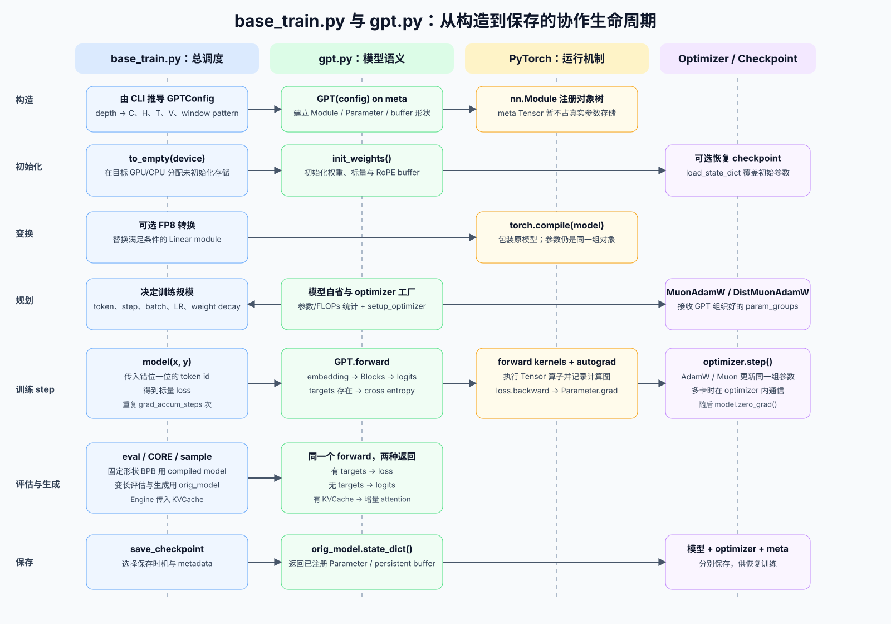
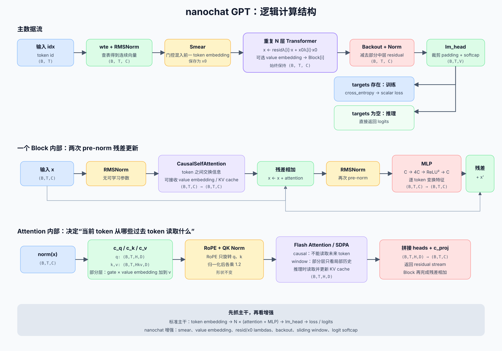
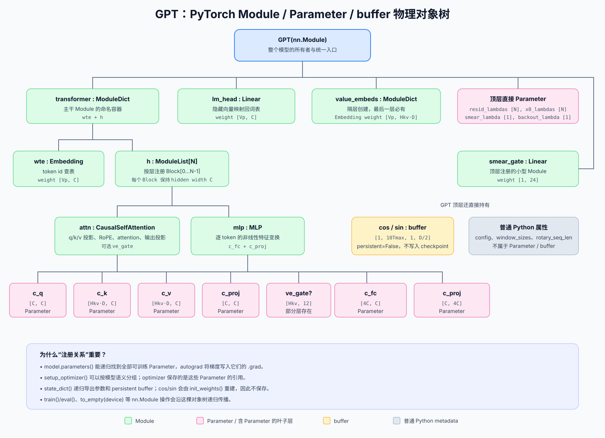

# `gpt.py`：nanochat 的模型定义与执行

这份文档不泛讲 Transformer，而是沿着 nanochat 当前源码回答三个问题：

1. [`nanochat/gpt.py`](../../nanochat/gpt.py) 究竟负责什么？
2. 它和 [`scripts/base_train.py`](../../scripts/base_train.py) 怎样配合完成预训练？
3. GPT 在数学计算上的“逻辑结构”和 PyTorch 程序里的“物理结构”分别是什么？

先记住最重要的一句话：

> `base_train.py` 决定何时以及用什么配置训练；`gpt.py` 定义被训练的函数、模型参数及其训练相关接口；
> PyTorch 执行 Tensor 运算、自动求导和 Module 生命周期；optimizer 根据梯度修改 GPT 的参数。

## 1. `gpt.py` 在预训练系统中的位置

从系统边界看，`gpt.py` 主要承担四类职责。

| 职责 | 对应代码 | 回答的问题 |
|---|---|---|
| 定义模型结构 | `GPTConfig`、`GPT`、`Block`、`CausalSelfAttention`、`MLP` | 模型由哪些层和参数组成？ |
| 定义前向计算 | `GPT.forward()` 及各子 Module 的 `forward()` | token id 怎样变成 logits 或 loss？ |
| 管理模型自身状态 | `init_weights()`、RoPE buffer、`state_dict()` 所依赖的 Module 注册关系 | 参数如何初始化、移动和保存？ |
| 向训练脚本暴露模型自省接口 | `num_scaling_params()`、`estimate_flops()`、`setup_optimizer()` | 模型有多大、计算量多大、参数怎样分组更新？ |

它不负责以下工作：

- 不读取 parquet，不进行文档 packing，也不构造训练 batch；这些由 dataloader 完成。
- 不决定训练多少 step、什么时候评估、什么时候保存；这些由 `base_train.py` 调度。
- 不执行 `backward()`；PyTorch autograd 根据 `forward()` 记录的计算图计算梯度。
- 不实现多卡进程启动；`torchrun` 和 `compute_init()` 创建进程与 process group。
- 不直接实现 AdamW/Muon 的更新公式；具体实现位于 `nanochat/optim.py`。

可以把系统的核心依赖关系理解成：

```text
base_train.py
    ├── 准备 GPTConfig、数据、训练日程和评估时机
    ├── 调用 GPT.forward 得到 loss / logits
    ├── 调用 PyTorch backward
    └── 调用 optimizer 更新 GPT 参数

gpt.py
    ├── 定义 Parameter 属于哪些 Module
    ├── 定义这些 Parameter 如何参与 forward
    └── 定义参数统计和 optimizer 分组规则
```

## 2. `gpt.py` 与 `base_train.py` 如何配合

下面这张图展示了从模型构造到 checkpoint 的完整生命周期。

[](images/gpt-base-train-lifecycle.svg)

### 2.1 构造阶段：训练脚本决定规模，GPT 建立结构

`base_train.py` 根据命令行参数推导模型宽度和 head 数：

```python
base_dim = depth * args.aspect_ratio
model_dim = ((base_dim + args.head_dim - 1) // args.head_dim) * args.head_dim
num_heads = model_dim // args.head_dim
```

再构造配置：

```python
config = GPTConfig(
    sequence_len=args.max_seq_len,
    vocab_size=vocab_size,
    n_layer=depth,
    n_head=num_heads,
    n_kv_head=num_heads,
    n_embd=model_dim,
    window_pattern=args.window_pattern,
)
```

职责边界是：

- `base_train.py` 选择 `depth`、`n_embd`、`n_head`、上下文长度和词表大小。
- `GPT.__init__()` 根据这些值创建 embedding、Block、lm_head、可学习标量和 RoPE buffer。
- `nn.Module` 自动注册子 Module、Parameter 和 buffer。

模型先在 `meta` device 上搭建：

```python
with torch.device("meta"):
    model = GPT(config)
```

此时只建立对象、shape 和 dtype，不为参数分配真实数据。随后：

```python
model.to_empty(device=device)
model.init_weights()
```

`to_empty()` 在目标设备分配存储，`init_weights()` 才写入真实初始值。

如果恢复训练，checkpoint 中的模型参数会覆盖刚初始化的参数；非持久化的 RoPE buffer 则由
`init_weights()` 重新生成。

### 2.2 运行前变换：FP8 与 `torch.compile`

启用 FP8 时，`base_train.py` 会在 compile 之前遍历 GPT 的 Module 树，把满足条件的 `Linear` 替换为
Float8 版本。模型结构由 GPT 提供，是否转换和转换时机由训练脚本决定。

接着：

```python
orig_model = model
model = torch.compile(model, dynamic=False)
```

这里不是复制了两份模型：

- `orig_model` 指向原始 `GPT` 对象。
- `model` 是 PyTorch 创建的编译包装对象。
- 包装对象内部仍使用 `orig_model` 的同一组 Parameter。

固定 `(B, T)` 形状的训练和 BPB 评估使用 compiled model；输入长度不断变化的 CORE 评测和生成使用
`orig_model`，避免反复重新编译。

### 2.3 训练规划：GPT 提供模型事实，训练脚本作决策

模型创建后，`base_train.py` 会调用：

```python
param_counts = model.num_scaling_params()
num_flops_per_token = model.estimate_flops()
optimizer = model.setup_optimizer(...)
```

三者的关系是：

| GPT 提供的信息或接口 | `base_train.py` 如何使用 |
|---|---|
| 参数分组及数量 | 计算 scaling params 和目标训练 token 数 |
| 每 token 训练 FLOPs 估计 | 计算目标 step、总 FLOPs、吞吐率和 MFU |
| 参数语义分组 | 建立组合 AdamW/Muon optimizer |

GPT 知道“哪些参数属于 embedding，哪些属于 Transformer block”；训练脚本知道“本次实验应使用多大的
batch 和基础学习率”。两者共同完成 optimizer 配置。

### 2.4 核心训练 loop：GPT 返回 loss，PyTorch 求梯度

一次 micro-step 的主干是：

```python
loss = model(x, y)
loss = loss / grad_accum_steps
loss.backward()
```

发生的事情是：

1. `model(x, y)` 最终进入 `GPT.forward(idx=x, targets=y)`。
2. GPT 根据自己定义的计算流程返回标量 cross-entropy loss。
3. PyTorch autograd 沿 forward 计算图反向传播，把梯度累加到每个 `Parameter.grad`。
4. 完成所有 micro-step 后，`optimizer.step()` 读取梯度并原地修改 GPT 的 Parameter。
5. `model.zero_grad(set_to_none=True)` 清理本次 step 的梯度。

因此，GPT 不需要自己调用 optimizer；optimizer 也不需要知道 GPT 的 forward 细节。两者通过同一组
Parameter 及其 `.grad` 字段连接。

### 2.5 评估、生成与保存

同一个 `GPT.forward()` 同时支持训练和推理：

```text
传 targets：返回 loss
不传 targets：返回 logits
再传 kv_cache：使用增量 KV cache 推理路径
```

`base_train.py` 据此完成：

- BPB 验证：模型返回 loss。
- CORE 评测：变长输入走 `orig_model`。
- 样例生成：`Engine` 调用 `orig_model.forward(..., kv_cache=...)`。
- checkpoint：保存 `orig_model.state_dict()`、`optimizer.state_dict()` 和训练 metadata。

还有一个容易误解的细节：当前 `gpt.py` 没有 Dropout、BatchNorm，也没有依据 `self.training` 切换的代码，
因此 `model.eval()` 目前通常不会改变 GPT 的数值计算。训练脚本仍然规范地调用 `eval()` / `train()`，是为了
正确表达生命周期，也为以后加入有训练/评估差异的 Module 留出空间。FP8 是否关闭由单独的
`disable_fp8(...)` context manager 控制。

## 3. 两种“模型结构”：逻辑结构与物理结构

讨论 GPT 结构时经常混淆两个不同问题。

### 3.1 逻辑结构：数据怎样计算

逻辑结构描述 Tensor 的变换关系，不关心这些运算分别存在哪个 Python 对象里：

```text
token id
  -> token embedding
  -> 多层 attention + MLP
  -> vocabulary logits
  -> loss 或下一个 token
```

下面是 nanochat 当前实现的完整逻辑结构，其中还包括 smear、value embedding、x0 residual 和 backout 等
项目特有设计。

[](images/gpt-logical-structure.svg)

### 3.2 物理结构：程序对象怎样组织

本文中的“物理结构”不是指 GPU 芯片上的物理地址，而是指运行时真正存在的 PyTorch 对象树：

```text
一个 GPT Python 对象
  -> 持有 ModuleDict / ModuleList / Block 等子对象
  -> 每个 Module 注册自己的 Parameter
  -> GPT 还注册 cos/sin buffer
  -> config/window_sizes 等作为普通 Python 属性存在
```

这种组织关系决定：

- `model.parameters()` 能找到什么。
- autograd 最终给哪些对象写 `.grad`。
- optimizer 能更新什么。
- `.to_empty()`、`.train()`、`.eval()` 怎样递归传播。
- `state_dict()` 会保存什么。

[](images/gpt-module-tree.svg)

逻辑结构和物理结构会在 `forward()` 时相遇：物理对象树中的 Module 被依次调用，共同实现逻辑数据流。

## 4. 先统一形状符号

读 GPT 源码最有效的方法是始终跟踪 Tensor shape。

| 符号 | 源码字段 | 含义 |
|---|---|---|
| `B` | runtime batch size | 一个 rank 的 micro-batch 序列数 |
| `T` | runtime sequence length | 本次 forward 的 token 数 |
| `Tmax` | `config.sequence_len` | 配置的最大训练上下文长度 |
| `V` | `config.vocab_size` | Tokenizer 的真实词表大小 |
| `Vp` | `padded_vocab_size` | 向上补齐到 64 倍数后的物理词表大小 |
| `N` | `config.n_layer` | Transformer Block 数量 |
| `C` | `config.n_embd` | residual stream / hidden size |
| `H` | `config.n_head` | query head 数量 |
| `Hkv` | `config.n_kv_head` | key/value head 数量 |
| `D` | `C / H` | 每个 attention head 的维度 |

主要 Tensor 形状如下：

| Tensor | 形状 | 含义 |
|---|---|---|
| `idx` | `(B, T)` | 输入 token id |
| `targets` | `(B, T)` | 每个位置的下一个 token id |
| `x` | `(B, T, C)` | residual stream / hidden state |
| `q` | `(B, T, H, D)` | query |
| `k, v` | `(B, T, Hkv, D)` | key、value |
| `logits` | `(B, T, V)` | 对真实词表中每个 token 的未归一化分数 |
| `loss` | 标量或指定 reduction 的结果 | next-token cross entropy |

以 `runs/speedrun.sh` 为例：

```text
depth = 24
aspect_ratio = 64
head_dim = 128

C = 24 × 64 = 1536
H = 1536 / 128 = 12
Hkv = H = 12
Tmax = 2048
```

虽然 `gpt.py` 支持 `Hkv < H` 的 Grouped-Query Attention，当前 `base_train.py` 构造配置时设置
`n_kv_head=num_heads`，所以基础预训练实际使用的是 `Hkv = H` 的普通多头注意力。GQA 能力主要是代码接口
已经预留，而不是这条训练命令当前启用的特性。

## 5. 程序中的物理结构

### 5.1 文件中的主要类型

| 类型或函数 | PyTorch 身份 | 主要作用 |
|---|---|---|
| `GPTConfig` | dataclass | 保存模型结构超参数，不是 Module |
| `norm(x)` | 普通函数 | 调用无可学习参数的 RMSNorm |
| `Linear` | `nn.Linear` 子类 | forward 时把权重 cast 到输入 dtype |
| `CausalSelfAttention` | `nn.Module` | QKV、位置、causal/sliding attention、KV cache |
| `MLP` | `nn.Module` | `C → 4C → ReLU² → C` |
| `Block` | `nn.Module` | attention 残差 + MLP 残差 |
| `GPT` | `nn.Module` | 装配全模型，定义 forward、初始化、自省和 optimizer 工厂 |

### 5.2 `GPT` 顶层 Module

`GPT.__init__()` 创建的主体可以简写为：

```python
self.transformer = nn.ModuleDict({
    "wte": nn.Embedding(Vp, C),
    "h": nn.ModuleList([Block(config, i) for i in range(N)]),
})
self.lm_head = Linear(C, Vp, bias=False)
```

除此之外还有：

- `resid_lambdas[N]`：每层进入 Block 前缩放当前 residual stream。
- `x0_lambdas[N]`：每层重新混入初始 embedding。
- `smear_gate` 和 `smear_lambda`：控制前一 token embedding 的混入。
- `backout_lambda`：控制最后减去多少中间层 hidden state。
- `value_embeds`：为隔层 attention value 提供额外的 token embedding。
- `cos/sin`：预计算 RoPE 的非持久化 buffer。

### 5.3 一个 Block 的 Module 与参数

每个 `Block` 包含：

```text
Block
├── attn: CausalSelfAttention
│   ├── c_q.weight       [C, C]
│   ├── c_k.weight       [Hkv·D, C]
│   ├── c_v.weight       [Hkv·D, C]
│   ├── c_proj.weight    [C, C]
│   └── ve_gate.weight?  [Hkv, 12]
└── mlp: MLP
    ├── c_fc.weight      [4C, C]
    └── c_proj.weight    [C, 4C]
```

所有 Linear 都没有 bias。`norm(x)` 使用 functional RMSNorm，也没有可学习的 scale 或 bias。因此
`gpt.py` 中不存在单独的 LayerNorm/RMSNorm Parameter。

### 5.4 Parameter、buffer 和普通属性的区别

| 类型 | 当前例子 | 是否由 optimizer 更新 | 是否默认进入 `state_dict()` |
|---|---|---:|---:|
| `nn.Parameter` | Linear/Embedding weight、各种 lambda | 是 | 是 |
| persistent buffer | 当前 GPT 没有使用 | 否 | 是 |
| non-persistent buffer | `cos`、`sin` | 否 | 否 |
| 普通 Python 属性 | `config`、`window_sizes`、`rotary_seq_len` | 否 | 否 |

`cos/sin` 会跟随 Module 移动设备，但不会写入模型 checkpoint，因为它们可以根据 config 重新计算。

配置并不是 `state_dict()` 的一部分，所以 `base_train.py` 会把 `model_config` 单独放到 checkpoint metadata。

### 5.5 自定义 `Linear` 为什么要 cast weight

自定义层只有一个关键变化：

```python
def forward(self, x):
    return F.linear(x, self.weight.to(dtype=x.dtype))
```

Transformer 矩阵和 lm_head 的 master weight 可以保持 FP32，optimizer 用较高精度维护参数；forward 时临时
转换到 activation dtype，通常是 BF16，再执行矩阵乘法。embedding 为节省显存会在 `init_weights()` 中直接
转成 `COMPUTE_DTYPE`，FP16 场景除外。

### 5.6 embedding 与 lm_head 不共享参数

有些 GPT 会让输入 embedding 和输出 lm_head 共用一块 weight，称为 weight tying。nanochat 分别创建：

```text
wte.weight      [Vp, C]
lm_head.weight  [Vp, C]
```

它们 shape 相同，但属于两个不同的 Parameter，初始化和 optimizer 超参数也不同。

## 6. 初始化：从空结构变成可训练模型

`GPT.__init__()` 必须能在 meta device 上运行，所以其中创建的 Tensor 只是“假数据”。真实初始化全部集中在
`init_weights()`。

主要规则如下：

| 参数 | 初始化 |
|---|---|
| token embedding | normal，`std=0.8` |
| lm_head | normal，`std=0.001` |
| attention q/k/v | uniform，标准差约为 `1/sqrt(C)` |
| attention output projection | 全 0 |
| MLP `c_fc` | 较小范围的 uniform，约为 qkv 的 `0.4` 倍 |
| MLP output projection | 全 0 |
| `resid_lambdas` | 随深度从约 `1.15` 线性降到 `1.05` |
| `x0_lambdas` | 随深度从约 `0.20` 线性降到 `0.05` |
| `smear_lambda` | `0` |
| `backout_lambda` | `0.2` |
| value embedding | 与 value projection 相近的 uniform |
| smear/value gate | 小的正 uniform |

attention 和 MLP 的输出 projection 从 0 开始，使它们在初始化时不会立刻向 residual stream 注入很大的
随机输出。随着训练开始，projection weight 会从 0 学起来。

RoPE 的 `cos/sin` 也在这里重新生成。缓存长度是 `10 × config.sequence_len`，用于为变长生成留出余量；
forward 会检查实际位置不能超过这个缓存。

## 7. `GPT.forward()` 的完整逻辑流程

方法签名是：

```python
forward(idx, targets=None, kv_cache=None, loss_reduction="mean")
```

这四个参数构成 GPT 对外最重要的执行契约。

| 参数 | 训练 | 普通推理 | KV cache 推理 |
|---|---:|---:|---:|
| `idx` | 输入序列 | prompt 或完整当前序列 | prefill prompt 或最新 token |
| `targets` | `y` | `None` | `None` |
| `kv_cache` | `None` | `None` | `KVCache` |
| 返回值 | loss | logits | logits |

### 7.1 `x/y` 为什么错开一位

dataloader 先得到一段 token：

```text
[BOS, 我, 喜欢, 猫]
```

再构造：

```text
x = [BOS, 我, 喜欢]
y = [我,   喜欢, 猫]
```

所以 `x[b, t]` 的 hidden state 用来预测 `y[b, t]`。causal attention 保证该位置只能读取自己及以前的
输入，不能偷看未来答案。

### 7.2 选择正确位置的 RoPE

训练没有 KV cache，从位置 0 开始：

```python
T0 = 0
```

增量推理时，过去 token 已在 cache 中，当前 token 的位置从 `kv_cache.get_pos()` 开始。GPT 据此从预计算
的 `cos/sin` 中切出 `[T0:T0+T]`。

### 7.3 token embedding 与第一次归一化

```python
x = self.transformer.wte(idx)
x = x.to(COMPUTE_DTYPE)
x = norm(x)
```

shape 变化：

```text
(B, T) token id
  -> Embedding lookup
(B, T, C) hidden vector
```

token id 只是离散编号；embedding 表把每个编号映射成可学习的连续向量。

### 7.4 Smear：给当前 token 混入前一个 token

训练或无 cache 推理时，对位置 `1...T-1`：

```text
gate_t = smear_lambda × sigmoid(smear_gate(x_t[:24]))
x_t    = x_t + gate_t × x_(t-1)
```

这是一条非常便宜的相邻 token 信息通道，可理解成可学习的 bigram shortcut。

初始 `smear_lambda=0`，所以训练刚开始时这条路径关闭，模型可以逐渐学会是否启用它。

KV cache decode 每次可能只有一个新 token，此时前一个 embedding 不在本次输入里，因此 `KVCache` 还会
保存 `prev_embedding`。

### 7.5 保存 `x0`，逐层进入 Transformer

Smear 之后：

```python
x0 = x
```

每层先执行：

```python
x = resid_lambdas[i] * x + x0_lambdas[i] * x0
```

含义是：

- 当前 residual stream 由 `resid_lambdas[i]` 缩放。
- 初始 token embedding 表示通过 `x0_lambdas[i]` 重新注入深层网络。

然后部分层根据原始 `idx` 查一张 value embedding 表：

```python
ve = self.value_embeds[str(i)](idx)  # 部分层才有
x = block(x, ve, cos_sin, self.window_sizes[i], kv_cache)
```

`has_ve()` 选择与最后一层同奇偶性的层，因此 value embedding 隔层出现，并保证最后一层存在。

### 7.6 一个 Block：attention 与 MLP 两个残差子层

`Block.forward()` 很短：

```python
x = x + self.attn(norm(x), ve, cos_sin, window_size, kv_cache)
x = x + self.mlp(norm(x))
return x
```

用公式表示：

```text
x' = x  + Attention(RMSNorm(x))
y  = x' + MLP(RMSNorm(x'))
```

这是 pre-norm Transformer：norm 位于子层之前。两个子层都输出 `(B,T,C)`，才能和 residual stream
逐元素相加。

两者的分工是：

```text
Attention：让一个 token 从其他可见 token 获取信息
MLP：对每个 token 自己的特征做非线性重组
```

### 7.7 Backout 与最终归一化

循环运行到 `i == N // 2` 时，GPT 保存一份中层 hidden state：

```python
x_backout = x
```

所有层结束后：

```python
x = x - backout_lambda * x_backout
x = norm(x)
```

代码注释给出的意图是，在投影到 logits 前减去部分中层的低级特征。它不是标准 GPT 必备结构，而是
nanochat 当前模型采用的一条可学习残差路径。

### 7.8 lm_head、词表裁剪与 logit softcap

```python
logits = self.lm_head(x)                    # (B,T,Vp)
logits = logits[..., :self.config.vocab_size]  # (B,T,V)
logits = logits.float()
logits = 15 * torch.tanh(logits / 15)
```

物理词表 `Vp` 补齐到 64 的倍数，有利于硬件计算；返回前裁剪到真实词表 `V`。

logits 随后转 FP32，并通过 `tanh` 平滑限制在约 `[-15, 15]`，避免极端 logit。logits 仍然不是概率。

### 7.9 有 targets 算 loss，否则返回 logits

训练路径：

```python
loss = F.cross_entropy(
    logits.view(-1, logits.size(-1)),
    targets.view(-1),
    ignore_index=-1,
    reduction=loss_reduction,
)
```

`cross_entropy` 内部会完成 `log_softmax`，所以调用前不需要手动把 logits 转成 probability。

`ignore_index=-1` 允许 dataloader 或评估代码把某些目标位置标为不参与 loss。

推理时没有 targets，GPT 直接返回 `(B,T,V)` logits，由外部生成逻辑选择最后一个位置并采样。

## 8. Attention 内部究竟做了什么

### 8.1 Q、K、V 投影

输入 `x` 为 `(B,T,C)`：

```python
q = c_q(x).view(B, T, H,   D)
k = c_k(x).view(B, T, Hkv, D)
v = c_v(x).view(B, T, Hkv, D)
```

直觉可以记成：

```text
q：当前位置想寻找什么
k：每个位置提供什么匹配索引
v：匹配到该位置后读取什么内容
```

`Hkv` 可以少于 `H`，多个 query head 共享较少的 key/value head，这就是 GQA。当前 base pretrain 配置中
`Hkv=H`。

### 8.2 Value embedding residual

如果当前层存在 `ve`：

```python
gate = 3 * torch.sigmoid(self.ve_gate(x[..., :12]))
v = v + gate.unsqueeze(-1) * ve
```

这里为每个 token、每个 KV head 计算 gate，把一份直接由 token id 查出的 value embedding 注入 `v`。
它增强了 value 流中的原始 token 信息。

注意：`ve_gate` 位于 `Block.attn` 内，因此 `setup_optimizer()` 会把它归入
`self.transformer.h.parameters()`，与其他 Block 矩阵一起走 Muon，而不是归入顶层的 small scalar AdamW
分组。

### 8.3 RoPE 与 QK Norm

```python
q = apply_rotary_emb(q, cos, sin)
k = apply_rotary_emb(k, cos, sin)
q, k = norm(q), norm(k)
q, k = 1.2 * q, 1.2 * k
```

RoPE 只作用于 q/k，因为二者决定注意力匹配；v 表示被读取的内容。

QK Norm 限制 q/k 的尺度，随后乘 `1.2` 让 attention 更尖锐。操作不改变 shape。

### 8.4 causal attention 与 sliding window

训练时：

```python
flash_attn.flash_attn_func(q, k, v, causal=True, window_size=window_size)
```

`causal=True` 保证位置 `t` 不能读取 `t+1` 以后的 token。

每层的 window 由 `window_pattern` 决定：

- `L`：使用完整上下文窗口。
- `S`：约为 `ceil((Tmax / 4) / 128) × 128`，即四分之一上下文并对齐到 128。
- pattern 按层循环；最后一层无论 pattern 是什么都强制使用 `L`。

例如 `Tmax=2048` 时，当前代码算出的短窗口是 `512`。

Hopper 且满足条件时使用 Flash Attention 3；其他设备由 `nanochat/flash_attention.py` 回退到 PyTorch
SDPA。选择哪种 kernel 不改变 GPT 的逻辑语义。

### 8.5 KV cache 推理分支

推理时如果传入 `kv_cache`：

```python
k_cache, v_cache = kv_cache.get_layer_cache(layer_idx)
y = flash_attn.flash_attn_with_kvcache(
    q, k_cache, v_cache,
    k=k, v=v,
    cache_seqlens=kv_cache.cache_seqlens,
    causal=True,
    window_size=window_size,
)
```

新的 k/v 被写进该层 cache，当前 q 可以读取缓存中的历史 k/v。只有最后一层处理完成后才调用
`kv_cache.advance(T)`，表示所有层都已经写完这批 token。

### 8.6 拼回 residual stream

attention kernel 输出 `(B,T,H,D)`，随后：

```python
y = y.contiguous().view(B, T, C)
y = c_proj(y)
```

`c_proj` 混合各个 head 的输出，并恢复 `(B,T,C)` 以便残差相加。

## 9. MLP 内部究竟做了什么

MLP 的计算是：

```python
x = c_fc(x)          # C -> 4C
x = F.relu(x).square()
x = c_proj(x)        # 4C -> C
```

shape 流：

```text
(B,T,C) -> (B,T,4C) -> (B,T,4C) -> (B,T,C)
```

Linear 只作用于最后一维，所以每个 token 的 MLP 可以独立、并行计算；它不会跨 token 读取数据。真正跨
token 的信息交换发生在 attention。

`ReLU²` 表示：

```text
activation(z) = max(0, z)²
```

激活函数在这里提供非线性表达能力。它与 Dropout 无关：ReLU² 是确定性的数值变换，不会随机丢弃神经元，
也不会让推理时自动跳过对应矩阵计算。

## 10. 标准 GPT 主干与 nanochat 增强结构

为了阅读源码时不迷路，可以把结构分成两层。

标准主干是：

```text
token embedding
  -> N × [pre-norm attention residual + pre-norm MLP residual]
  -> final norm
  -> lm_head
  -> cross entropy / logits
```

nanochat 当前实现增加了：

| 设计 | 所在位置 | 作用 |
|---|---|---|
| RoPE | attention q/k | 注入相对位置信息 |
| QK Norm 与 `×1.2` | attention q/k | 控制匹配尺度并锐化 attention |
| Sliding window | attention kernel | 部分层减少远距离 attention 计算 |
| Value embedding residual | 部分 attention 层 | 向 value 注入 token-level 信息 |
| Smear | embedding 后 | 门控混入前一 token embedding |
| `resid_lambdas` | 每个 Block 前 | 调整 residual stream 尺度 |
| `x0_lambdas` | 每个 Block 前 | 重复注入初始 embedding |
| Backout | Block stack 之后 | 减去一部分中层 hidden state |
| Logit softcap | lm_head 之后 | 平滑抑制极端 logits |
| Padded vocabulary | embedding / lm_head | 将物理维度补齐到硬件友好倍数 |

第一次阅读时先抓住标准主干；第二次再逐个追踪增强路径的输入、输出和 Parameter。

## 11. `setup_optimizer()`：为什么定义在 GPT 里

optimizer 的更新公式在 `optim.py`，但参数分组入口放在 `GPT.setup_optimizer()`，因为 GPT 最清楚参数的
模型语义。

### 11.1 AdamW 参数组

| 参数 | 来源 |
|---|---|
| lm_head | `self.lm_head.parameters()` |
| token embedding | `self.transformer.wte.parameters()` |
| value embeddings | `self.value_embeds.parameters()` |
| residual lambdas | `self.resid_lambdas` |
| x0 lambdas | `self.x0_lambdas` |
| smear/backout | `smear_gate.weight`、`smear_lambda`、`backout_lambda` |

这些组拥有各自的 learning rate、betas、epsilon 和 weight decay。

### 11.2 Muon 参数组

```python
matrix_params = list(self.transformer.h.parameters())
```

也就是所有 Block 内部参数，包括 attention、MLP 和存在于部分 Block 中的 `ve_gate`。它们再按 shape 分组，
便于 optimizer 把同 shape 矩阵堆叠处理。

### 11.3 单卡与多卡选择

```python
Factory = DistMuonAdamW if ddp else MuonAdamW
optimizer = Factory(param_groups)
```

GPT 只根据分布式环境选择工厂；具体 collective communication 在 `DistMuonAdamW` 内部发生。

即使多卡训练，`base_train.py` 也没有用 PyTorch `DistributedDataParallel(model)` 包 GPT。每个 rank 都有
完整 GPT Module 和完整参数，optimizer 在更新过程中自行同步。这一点不改变 GPT 的对象结构。

## 12. 参数量和 FLOPs 接口

### 12.1 `num_scaling_params()`

该方法按模型语义返回：

```text
wte
value_embeds
lm_head
transformer_matrices
scalars
total
```

`base_train.py` 当前选择：

```text
scaling_params = transformer_matrices + lm_head
```

再用它估算目标训练 token 数。详细的 scaling law 和 batch/LR 计算见
[`pre-train.md`](pre-train.md) 的“参数量、FLOPs 和训练规模如何估算”小节。

### 12.2 `estimate_flops()`

估算由两部分组成：

```text
矩阵参数的 forward + backward FLOPs
+ 各层 attention 的 QK / AV FLOPs
```

attention 部分会逐层读取 `window_sizes`，因此短窗口层的有效序列长度更小。

这是训练计算量估计，不是 forward 单独的 FLOPs，也不是实际运行时间；kernel、显存带宽、通信和硬件利用率
都会影响最终速度。

## 13. 训练时 Parameter、gradient 与 optimizer state 如何流动

可以把一次更新理解为同一 Parameter 经历的状态变化：

```text
GPT Parameter θ
  -> GPT.forward 用 θ 计算 loss
  -> autograd 计算 dloss/dθ，写入 θ.grad
  -> optimizer.step 读取 θ、θ.grad 和历史 state
  -> optimizer 原地修改 θ
  -> 下一次 GPT.forward 读取新的 θ
```

`base_train.py` 中的梯度累积意味着：

```text
micro-step 1 backward：grad += g1 / K
micro-step 2 backward：grad += g2 / K
...
micro-step K backward：grad += gK / K
optimizer.step：只更新一次参数
zero_grad：清空累计梯度
```

GPT 的参数、梯度和 optimizer 历史状态是不同东西：

| 状态 | 所有者 | checkpoint 中的位置 |
|---|---|---|
| 当前模型 Parameter | GPT | model state_dict |
| 当前 `.grad` | 临时训练状态 | 通常不保存 |
| AdamW/Muon momentum 等 | optimizer | optimizer state_dict |
| config、step、dataloader 位置 | 训练脚本 | metadata |

只恢复模型参数可以推理；要保留原来的优化轨迹继续训练，还要恢复 optimizer state。要做到 bit-level 精确
接续，还需恢复 dataloader、随机数和其他运行状态。

## 14. 推理：同一个 GPT，另一种调用方式

### 14.1 `GPT.generate()`：最容易理解的朴素生成

`GPT.generate()` 每轮都：

```text
把当前完整 ids 喂给 forward
  -> 取最后位置 logits
  -> 可选 top-k
  -> temperature / argmax 选下一个 token
  -> 拼回 ids
```

优点是简单；缺点是每生成一个 token 都重新计算整个历史序列。由于无 cache 的 Smear 路径要求 `T>1`，
调用这个朴素方法时初始 token 列表也应至少包含两个 token。

### 14.2 `Engine` + `KVCache`：实际高效生成

`base_train.py` 的抽样使用 `nanochat.engine.Engine`：

1. Prefill：一次输入完整 prompt，各层把 prompt 的 k/v 写入 cache。
2. Decode：以后每次只输入一个新 token。
3. 新 q 读取过去缓存的 k/v，同时把自己的 k/v 追加到 cache。

因此历史 k/v 不再重复计算。GPT 自身通过 `kv_cache is None` 判断走训练/普通 attention 还是 cache attention；
cache 的分配和生成循环由 `Engine` 负责。

## 15. 推荐的源码阅读顺序

第一次阅读不要从 RoPE 数学或 Flash Attention kernel 开始，建议按下面顺序：

1. 看 `GPTConfig` 和 `base_train.py::build_model_meta()`，写下 `N/C/H/Hkv/D/T/V`。
2. 看 `GPT.__init__()`，对照物理对象树找到所有 Module、Parameter、buffer。
3. 看 `GPT.forward()`，只跟踪 `idx → x → logits/loss` 和 shape。
4. 看 `Block.forward()`，理解两个 pre-norm residual 子层。
5. 看 `MLP.forward()`，确认它不跨 token。
6. 看 `CausalSelfAttention.forward()`，依次理解 QKV、causal、RoPE、window、KV cache。
7. 回看 Smear、value embedding、x0 residual 和 backout 等 nanochat 增强。
8. 最后看 `init_weights()`、`setup_optimizer()`、`estimate_flops()` 和 `num_scaling_params()`。

## 16. 学完这一章应该能回答的问题

1. 为什么 `base_train.py` 负责创建 `GPTConfig`，而具体 Module 在 `gpt.py` 中创建？
2. 为什么 meta device 构造后还必须依次调用 `to_empty()` 和 `init_weights()`？
3. 逻辑结构与 PyTorch Module 物理结构有什么区别？
4. `idx` 为什么是 `(B,T)`，embedding 后为什么变成 `(B,T,C)`？
5. Attention 与 MLP 分别负责哪一种信息变换？
6. 为什么一个 Block 的输入输出都必须保持 `(B,T,C)`？
7. 当前 base pretrain 是否真的使用了 GQA？为什么？
8. `targets` 存在与否为什么能让同一个 forward 同时服务训练和推理？
9. compiled model 与 `orig_model` 是不是两套独立参数？
10. optimizer 为什么能修改 GPT，它们通过什么对象连接？
11. 哪些状态在 model state_dict，哪些在 optimizer state_dict，哪些由 metadata 保存？
12. KV cache 为什么能加速自回归生成？

如果这些问题都能独立回答，就已经从“知道 GPT 是 Transformer”进展到了“能沿 nanochat 源码解释 GPT 如何
被构造、执行、训练、评估和保存”。

## 17. Q&A

这一章集中记录阅读 `gpt.py` 时容易混淆、但又会反复遇到的问题。前面的章节按照源码流程展开，这一章则
按照问题快速建立概念之间的连接。

### 17.1 Embedding 查表为什么得到 `(B,T,C)`？`(B,T,V)` 和 `H` 又是什么？

`BTC`、`BTV` 不是 Tensor 名称，而是省略逗号后的 shape 简写：

```text
BTC = (B, T, C)
BTV = (B, T, V)
```

各符号表示：

| 符号 | 含义 | 在 nanochat 中的来源 |
|---|---|---|
| `B` | batch size，一个 rank 本次处理多少条序列 | `idx.size(0)` |
| `T` | sequence length，每条序列有多少个 token | `idx.size(1)` |
| `C` | hidden/embedding dimension，每个 token 用多少个隐藏特征表示 | `config.n_embd` |
| `V` | Tokenizer 的真实 vocabulary size | `config.vocab_size` |
| `Vp` | 向上补齐到 64 倍数的物理 vocabulary size | `padded_vocab_size` |
| `H` | query attention head 数量 | `config.n_head` |
| `Hkv` | key/value attention head 数量 | `config.n_kv_head` |
| `D` | 每个 attention head 的维度 | `C / H` |
| `N` | Transformer Block 数量 | `config.n_layer` |

输入 `idx` 是整数 token id：

```text
idx.shape = (B,T)
```

Embedding 参数是一张二维表：

```text
wte.weight.shape = (Vp,C)
```

表中每一行对应一个 token id，每一行包含该 token 的 `C` 维可学习向量。执行：

```python
x = self.transformer.wte(idx)
```

相当于对 `idx` 中的每个整数选择 `wte.weight` 的对应行：

```text
idx[b,t] = token_id

x[b,t,:] = wte.weight[token_id,:]
```

原来的 `B/T` 结构保持不变，每个 token id 后面增加一个 `C` 维向量：

```text
(B,T) -> (B,T,C)
```

例如：

```text
B = 2：两条序列
T = 3：每条序列三个 token
C = 4：每个 token 用四个数字表示

idx.shape = (2,3)
wte(idx).shape = (2,3,4)
```

可以把 `x[b,t,c]` 读成：

```text
第 b 条序列
第 t 个 token
第 c 个隐藏特征的数值
```

经过全部 Transformer Block 后，hidden state 仍为 `(B,T,C)`。`lm_head` 再把每个 `C` 维向量映射成
`Vp` 个词表分数：

```text
(B,T,C)
  -> lm_head
(B,T,Vp)
  -> 裁掉补齐部分
(B,T,V)
```

所以 `logits[b,t,v]` 表示：第 `b` 条序列第 `t` 个位置认为下一个 token 是词表第 `v` 项的分数。

`H` 出现在 Attention 内部。Attention 把一个 `C` 维空间拆成多个 head：

```text
C = H × D
```

以 speedrun 的 d24 模型为例：

```text
C = 1536
H = 12
D = 128

1536 = 12 × 128
```

所以 q 的 shape 是：

```text
(B,T,C) -> (B,T,H,D)
```

k/v 则是：

```text
(B,T,Hkv,D)
```

还要区分两个容易混淆的名字：

- `self.transformer.h` 中的小写 `h` 是存放多个 Block 的字段名。
- shape 符号中的大写 `H` 是 Attention 的 query head 数量。

### 17.2 “先抓主干，再看增强”具体应该怎样拆？

这里的“增强”不是说当前代码一定可以把它们关闭，而是说它们不是理解 GPT 最小数据流的第一步。它们都
真实参与当前 nanochat GPT 的计算。

#### 第一步：只看 GPT 主干

```text
token id
  -> token embedding
  -> N 个 Transformer Block
       -> Attention residual
       -> MLP residual
  -> final norm
  -> lm_head
  -> logits
  -> loss / sampling
```

每一环负责的工作是：

| 主干环节 | shape 变化 | 作用 |
|---|---|---|
| `wte` | `(B,T) -> (B,T,C)` | 把离散 token id 变成连续向量 |
| RMSNorm | shape 不变 | 稳定 hidden state 的数值尺度 |
| Attention | `(B,T,C) -> (B,T,C)` | 让一个 token 从其他可见 token 获取信息 |
| Attention residual | shape 不变 | 保留原 hidden state，同时叠加 Attention 输出 |
| MLP | `(B,T,C) -> (B,T,C)` | 独立加工每个 token 内部的隐藏特征 |
| MLP residual | shape 不变 | 保留 Attention 后的状态，同时叠加 MLP 输出 |
| N 个 Block | 始终为 `(B,T,C)` | 反复构造越来越充分的上下文表示 |
| final norm | shape 不变 | 在输出到词表前再次稳定数值尺度 |
| `lm_head` | `(B,T,C) -> (B,T,Vp)` | 为每个位置产生词表分数 |
| vocabulary crop | `(B,T,Vp) -> (B,T,V)` | 去掉为了硬件效率补齐的虚拟词表项 |
| cross entropy | logits + targets -> loss | 衡量 next-token prediction 的错误程度 |

主干中最关键的分工是：

```text
Attention：token 与 token 之间交换信息
MLP：每个 token 内部重组隐藏特征
Residual：保留已有表示，只让子层学习增量
```

#### 第二步：再看 Attention 自己的主干

```text
x
  -> q/k/v projection
  -> q 与 k 计算匹配程度
  -> causal mask 禁止读取未来
  -> attention weight 加权汇总 v
  -> 拼接 heads
  -> c_proj
```

先理解“当前 token 从哪些过去 token 读取什么”，再深入 RoPE、QK Norm、GQA、Flash Attention 和 KV
cache。

#### 第三步：把 nanochat 增强逐个插回主干

| 增强 | 插入位置 | 解决的问题或作用 |
|---|---|---|
| Smear | token embedding 后 | 直接、低成本地把前一 token embedding 混入当前位置 |
| RoPE | q/k projection 后 | 让 Attention 感知 token 的相对位置 |
| QK Norm | RoPE 后 | 限制 q/k 数值尺度，稳定 Attention matching |
| q/k `×1.2` | QK Norm 后 | 使 Attention 分布更尖锐 |
| Sliding window | Attention kernel | 让部分层只读取附近历史，减少长序列计算 |
| Value embedding residual | 部分层的 v | 向深层 value 流重新注入 token-level 信息 |
| `resid_lambdas` | 每个 Block 前 | 学习每层当前 residual stream 的缩放比例 |
| `x0_lambdas` | 每个 Block 前 | 将最初的 embedding 表示重新注入深层 |
| Backout | 全部 Block 后 | 减去一部分中层 hidden state |
| Logit softcap | lm_head 后 | 平滑抑制极端 logits |
| Padded vocabulary | wte/lm_head 的物理维度 | 将矩阵维度补齐到硬件友好的 64 倍数 |

推荐分三遍阅读：

```text
第一遍：wte -> Blocks -> lm_head -> loss
第二遍：Block -> Attention + MLP + residual
第三遍：Smear、RoPE、Value embedding、x0、Backout 等增强
```

### 17.3 `wte`、`h` 和 `lm_head` 是什么关系？

`GPT.__init__()` 中的核心对象是：

```python
self.transformer = nn.ModuleDict({
    "wte": nn.Embedding(Vp, C),
    "h": nn.ModuleList([
        Block(config, layer_idx)
        for layer_idx in range(N)
    ]),
})

self.lm_head = Linear(C, Vp, bias=False)
```

`wte` 是 token embedding：

```text
(B,T) token id -> (B,T,C) hidden vector
```

`h` 是一个 `ModuleList`。`range(N)` 会创建 `0...N-1` 共 N 个独立 Block：

```text
h[0]
h[1]
...
h[N-1]
```

每个 Block 都有自己独立的 Attention、MLP 和 Parameter。`ModuleList` 只负责保存和注册它们，不会自动
执行。真正的执行发生在 `GPT.forward()`：

```python
for i, block in enumerate(self.transformer.h):
    x = block(x, ...)
```

因此，`h` 可以理解为 Transformer trunk 中按深度排列的 N 层 Block。

`lm_head` 是 language-model head，也常称为 output projection 或 unembedding。它不是另一个 Transformer
Block，只是一个 Linear：

```text
每个 token 的 C 维 hidden vector
  -> lm_head
Vp 个 vocabulary logits
```

从逻辑计算顺序看，`lm_head` 确实接在所有 Transformer Block 后面，但中间还存在 Backout 和 final norm：

```text
wte
  -> h[0]
  -> h[1]
  -> ...
  -> h[N-1]
  -> backout
  -> final norm
  -> lm_head
  -> vocabulary crop / softcap
  -> loss 或 logits
```

从程序对象的物理结构看：

```text
GPT
├── transformer : ModuleDict
│   ├── wte : Embedding
│   └── h : ModuleList[N 个 Block]
└── lm_head : Linear
```

所以 `lm_head` 是 GPT 顶层的子 Module，是 `transformer` 的兄弟节点；但 `GPT.forward()` 让它在
Transformer trunk 之后执行。

这也说明：对象在 `__init__()` 中的声明位置或注册顺序，不等于 forward 的执行顺序。

### 17.4 `nn.Module` 会自动把子 Module 首尾连接并依次执行吗？

不会。普通 `nn.Module` 主要提供“注册和生命周期管理”，不会根据子 Module 的声明顺序猜测模型的数据流。

可以把 `nn.Module` 的工作拆成两部分。

#### `__init__()`：建立并注册对象树

当代码把 Module、Parameter 或 buffer 赋值给当前 Module 时，PyTorch 会登记它们：

```python
class MyModel(nn.Module):
    def __init__(self):
        super().__init__()
        self.layer_a = nn.Linear(10, 20)
        self.layer_b = nn.Linear(20, 30)
```

这里建立的是所有权关系：

```text
MyModel
├── layer_a
└── layer_b
```

注册之后，PyTorch 才能递归实现：

- `model.parameters()`：找到所有可训练 Parameter。
- `model.state_dict()`：导出参数和 persistent buffer。
- `model.to(device)` / `to_empty(device)`：递归移动或分配 Tensor。
- `model.train()` / `eval()`：递归设置子 Module 的 training 状态。
- optimizer：接收 `model.parameters()` 或按语义挑选出的 Parameter。

但只完成注册，并没有建立：

```text
layer_a 的输出 -> layer_b 的输入
```

#### `forward()`：显式定义数据流和连接关系

连接关系由模型作者在 `forward()` 中定义：

```python
def forward(self, x):
    x = self.layer_a(x)
    x = F.relu(x)
    x = self.layer_b(x)
    return x
```

这里才明确建立：

```text
x -> layer_a -> ReLU -> layer_b -> output
```

如果把 forward 改成：

```python
def forward(self, x):
    a = self.layer_a(x)
    b = self.layer_a(x)       # 同一个子 Module 可以调用多次
    return a + b              # layer_b 甚至可以完全不调用
```

PyTorch 也会照此执行。它不会因为 `layer_b` 已注册就强制调用它。

所以：

```text
__init__：定义“我拥有哪些积木”
forward：定义“积木怎样连接、按什么控制流执行”
```

#### `model(x)` 与 `forward(x)` 的关系

通常调用：

```python
output = model(x)
```

而不是直接调用：

```python
output = model.forward(x)
```

`model(x)` 会先进入 `nn.Module.__call__()`。它负责处理 Module hooks 等框架机制，然后再调用当前类实现的
`forward()`。可以近似理解为：

```text
model(x)
  -> nn.Module.__call__
       -> forward pre-hooks
       -> model.forward(x)
       -> forward hooks
  -> output
```

具体数学连接仍由 `forward()` 定义，`__call__()` 不会替模型推断连接关系。

#### `ModuleList`、`ModuleDict` 和 `Sequential` 的区别

| 容器 | 是否注册子 Module | 是否自带顺序 forward | 典型用途 |
|---|---:|---:|---|
| `nn.ModuleList` | 是 | 否 | 保存一组层，由自己写循环、条件或跳跃连接 |
| `nn.ModuleDict` | 是 | 否 | 按名称保存层，由自己决定调用哪些成员 |
| `nn.Sequential` | 是 | 是 | 按保存顺序执行 `x = module(x)`，适合简单首尾串联 |

`nn.Sequential` 看起来像 PyTorch 自动连接子 Module，是因为 `Sequential` 这个类已经替我们实现了类似下面的
forward：

```python
def forward(self, x):
    for module in self:
        x = module(x)
    return x
```

这不是所有 `nn.Module` 的天然行为，而是 `nn.Sequential` 的特定行为。

#### nanochat GPT 的执行顺序全部由 forward 明确规定

GPT 顶层在 `GPT.forward()` 中明确调用：

```text
wte -> Smear -> 遍历 h 中的 Block -> Backout -> norm -> lm_head
```

每个 Block 又在 `Block.forward()` 中明确调用：

```python
x = x + self.attn(norm(x), ...)
x = x + self.mlp(norm(x))
```

所以一个 Block 的顺序是：

```text
Attention residual
  -> MLP residual
```

Attention 内部的 q/k/v、RoPE、Flash Attention 和 `c_proj` 也由
`CausalSelfAttention.forward()` 逐步连接。

PyTorch 在实际 forward 过程中观察 Tensor 运算和数据依赖，建立本轮 autograd 计算图。之后
`loss.backward()` 按依赖关系反向传播。`torch.compile()` 可以捕获并优化这段 forward，但也不会替 GPT
发明新的 Module 连接顺序。

### 17.5 `lm_head` 中的 “head” 是什么意思？它与词表大小 `V` 有什么关系？

`lm_head` 的全称是 Language Modeling Head，更准确的中文是“语言模型输出头”。

这里的 “head” 不是 Attention Head，也不是说它位于模型最前面。在神经网络中，head 通常表示：

> 接在通用模型主干最后，将主干产生的 hidden state 转换成某项具体任务输出的层。

例如分类模型可以有 classification head；语言模型则用 language modeling head 产生对下一个 token 的预测。

nanochat 的 `lm_head` 是：

```python
self.lm_head = Linear(C, Vp, bias=False)
```

它与词表大小的关系非常直接：

> 真实词表有 `V` 个 token，模型就必须为每个位置产生 `V` 个有效分数，每个分数对应一个候选 token。

Transformer trunk 最后输出：

```text
x.shape = (B,T,C)
```

对某个位置 `(b,t)`，`x[b,t,:]` 是一个 `C` 维 hidden vector。`lm_head` 用权重矩阵把它映射到词表空间：

```text
lm_head.weight.shape = (Vp,C)

logits[b,t,:] = lm_head.weight @ x[b,t,:]
```

因此 shape 变化为：

```text
(B,T,C)
  -> lm_head
(B,T,Vp)
  -> 裁掉补齐的词表项
(B,T,V)
```

`logits[b,t,v]` 表示：第 `b` 条序列第 `t` 个位置认为下一个 token 是词表第 `v` 项的分数。

假设有一个玩具词表：

```text
V = 6

0: <bos>
1: 我
2: 喜欢
3: 猫
4: 狗
5: <eos>
```

并且 hidden dimension 为：

```text
C = 4
```

那么 `lm_head` 可以简化成：

```python
Linear(4, 6)
```

其权重为：

```text
lm_head.weight.shape = (6,4)
```

假设“我喜欢”最后一个位置的 hidden vector 是：

```text
x_t = [0.3, -0.2, 0.7, 0.1]
```

`lm_head` 会产生六个 logits：

```text
[-1.2, 0.3, -0.5, 2.1, 1.4, -0.8]
  BOS   我   喜欢   猫   狗   EOS
```

“猫”的 logit 最大，表示模型当前最倾向于预测“猫”。这些 logits 还不是 probability：训练时
`cross_entropy` 会在内部处理它们，推理时生成逻辑会根据 temperature、softmax 或 argmax 选择 token。

`wte` 和 `lm_head` 可以看成方向相反的两个边界层：

```text
wte：
token id -> hidden vector
V -> C

lm_head：
hidden vector -> 每个 token 的预测分数
C -> V
```

它们的物理权重 shape 看起来相同：

```text
wte.weight.shape     = (Vp,C)
lm_head.weight.shape = (Vp,C)
```

但 nanochat 没有进行 weight tying；它们是两个独立 Parameter：

- `wte` 根据 token id 选择一行，把 token 放进 hidden space。
- `lm_head` 让每一行与 hidden vector 做点积，把 hidden state 投影回 vocabulary space。

nanochat 使用 `Vp` 而不是直接使用 `V`，是因为它会把真实词表大小向上补齐到 64 的倍数，使矩阵维度更适合
GPU。forward 最后执行：

```python
logits = logits[..., :self.config.vocab_size]
```

所以补齐出来的词表项不会成为真实预测结果。

词表大小还直接影响 lm_head 的参数量和 logits 的大小：

```text
lm_head 参数量 = Vp × C
logits 元素数量 = B × T × V
```

因此 `V` 越大，lm_head 参数、输出 Tensor 和相关计算通常也越大。

### 17.6 Hidden state 就是模型的中间结果吗？

广义上可以这样理解，但更准确地说：

> Hidden state 是模型在某一层、某个 token 位置上维护的内部特征表示；它是中间结果的一种，但并不是所有
> 中间 Tensor 都称为 hidden state。

在 GPT 主干中，hidden state 通常就是代码里反复更新的 `x`：

```text
x.shape = (B,T,C)
```

其中 `x[b,t,:]` 是第 `b` 条序列第 `t` 个 token 当前拥有的 `C` 维内部表示。

它之所以叫 hidden state：

- `hidden`：它不是用户输入的 token id，也不是最终输出的 logits，而是模型内部学习出来的表示。
- `state`：它概括了模型处理到当前层时，对每个 token 及其可见上下文所掌握的信息。

在 nanochat GPT 中，hidden state 的演化过程是：

```text
idx                         token id，不是 hidden state
  -> wte + norm
x0                          初始 hidden state / embedding representation
  -> Block[0]
x_after_block_0             第 0 层 hidden state
  -> Block[1]
x_after_block_1             第 1 层 hidden state
  -> ...
  -> Block[N-1]
x_after_block_N_minus_1     最后一层 hidden state
  -> backout + final norm
x_final                     lm_head 接收的最终 hidden state
  -> lm_head
logits                      词表分数，通常不再称为 hidden state
```

代码复用同一个变量名 `x`，并不表示只有一份 hidden state。每次：

```python
x = block(x, ...)
```

都会产生下一层的新 hidden state，旧值则作为该计算的输入并由 autograd 在需要时保留相关信息。

对于 causal GPT，第 `t` 个位置的 hidden state 只能概括当前 token 和允许读取的历史 token，不能包含未来
token 的信息。随着 Block 层数增加，它通常从较低级的 token 特征逐渐变成更充分的上下文表示。

下面这些 Tensor 虽然也是中间计算结果，但通常使用更具体的名称：

| Tensor | 是否通常称为 hidden state | 更准确的名称 |
|---|---:|---|
| embedding/Block 输出 `x` | 是 | hidden state / residual stream |
| `x_backout` | 是 | 某个中层 hidden state 的快照 |
| `q/k/v` | 否 | Attention query/key/value |
| attention score/weight | 否 | Attention 匹配分数或权重 |
| MLP 中的 `(B,T,4C)` Tensor | 通常不称为主干 hidden state | MLP intermediate activation |
| `logits` | 否 | vocabulary logits |
| `loss` | 否 | 训练目标值 |
| `Parameter.grad` | 否 | 参数梯度 |

因此可以记成：

```text
所有 hidden state 都是中间结果；
但不是所有中间结果都叫 hidden state。
```

还要避免把它与下面几种 “state” 混淆：

- model state：模型 Parameter 和 buffer，通常由 `state_dict()` 导出。
- optimizer state：AdamW/Muon 的 momentum 等历史数据。
- dataloader state：当前读取到哪个 epoch、parquet/row group。
- KV cache：推理时保存的历史 key/value，不等于 Transformer 主干的 hidden state。

Transformer 的 hidden state 通常在每次 forward 时根据输入重新计算；它不是像 optimizer state 那样跨训练
step 长期保存的持久状态。
