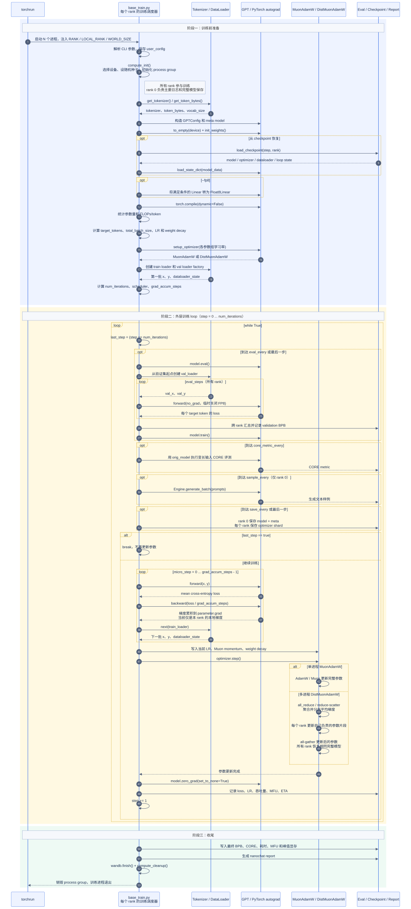

## 预训练命令
在`speedrun.sh`中，完成数据集下载以及tokenizer训练后，下一步是模型预训练。
```bash
# -----------------------------------------------------------------------------
# Base model (pretraining)
echo "Waiting for dataset download to complete..."
wait $DATASET_DOWNLOAD_PID

# d24 model (slightly undertrained to beat GPT-2 => decrease data:params ratio from compute optimal 10.5 (default) to 8)
torchrun --standalone --nproc_per_node=8 -m scripts.base_train -- --depth=24 --target-param-data-ratio=8 --device-batch-size=16 --fp8 --run=$WANDB_RUN
# evaluate the model: CORE metric, BPB on train/val, and draw samples
torchrun --standalone --nproc_per_node=8 -m scripts.base_eval -- --device-batch-size=16
```

这里需要关注一下torchrun命令。
```
torchrun --standalone --nproc_per_node=8 -m scripts.base_train -- --depth=24 --target-param-data-
ratio=8 --device-batch-size=16 --fp8 --run=$WANDB_RUN
```

可以拆成两层理解。

第一层是 torchrun 启动分布式进程：

- torchrun：PyTorch 的分布式启动器。
- --standalone：单机训练，不需要多机 rendezvous 配置。
- --nproc_per_node=8：在本机启动 8 个 Python 进程，通常对应 8 张 GPU。
- -m scripts.base_train：每个进程都执行等价于：
```
python -u -m scripts.base_train ...
```
- 中间单独的 --：分隔 torchrun 自己的参数和传给 scripts.base_train 的参数。

第二层是传给训练脚本的配置：

- --depth=24：训练 24 层 Transformer，也就是注释里说的 d24 model。
- --target-param-data-ratio=8：按“训练 token 数 / 参数量”比例为 8 来自动算训练步数。对应 scripts/
base_train.py:269 和 scripts/base_train.py:349。

- --device-batch-size=16：每张 GPU 每个 micro-batch 放 16 条序列。默认 max_seq_len=2048，所以每个
rank 每次 forward/backward 是 16 * 2048 个 token。

- --fp8：启用 FP8 训练，主要面向 H100+ CUDA GPU。
- --run=$WANDB_RUN：传 wandb run 名；如果是 dummy 就不用真实 wandb。

**它启动训练的链路是（核心流程）：**

1. torchrun 启动 8 个进程，并给每个进程设置 RANK、LOCAL_RANK、WORLD_SIZE 等环境变量。
2. 每个进程运行 scripts/base_train.py。
   * base_train.py进行参数解析。
   * 调 compute_init()：它会 根据 LOCAL_RANK 绑定 对应 GPU，并初始化 NCCL process group。
   * 脚本加载 tokenizer、建模型、初始化权重、启用 FP8、torch.compile、创建 optimizer 和
      dataloader。
   * 真正训练循环从 scripts/base_train.py:416 的 while True: 开始；核心训练步骤在 scripts/
base_train.py:510：forward、backward、取下一批数据、optimizer.step()、清梯度、打印日志。

**一个容易忽略的点**：这里不是通过 DistributedDataParallel(model) 包模型。项目里是自定义分布式
optimizer：如果检测到 torchrun 环境，nanochat/gpt.py:410 会选择 DistMuonAdamW，它在 nanochat/
optim.py:299 里用 reduce_scatter / all_reduce / all_gather 做梯度和参数同步。数据加载也会按 rank
分片，见 nanochat/dataloader.py:33 和 nanochat/dataloader.py:62。

### base_train的参数与含义 

| 参数 | 默认值 | 类别 | 含义 |
|---|---:|---|---|
| `--run` | `dummy` | 日志 | wandb run 名称。`dummy` 表示不启用真实 wandb 上传。 |
| `--device-type` | 空字符串 | 运行设备 | 指定训练设备：`cuda`、`cpu` 或 `mps`。空字符串表示自动检测。 |
| `--fp8` | 关闭 | FP8 | 启用 FP8 训练，主要用于 H100+ CUDA GPU。 |
| `--fp8-recipe` | `tensorwise` | FP8 | FP8 缩放策略。CLI 虽然列出了 `tensorwise` 和 `rowwise`，但当前 `nanochat/fp8.py` 的自定义实现只支持 `tensorwise`；传 `rowwise` 会抛出 `ValueError`。 |
| `--depth` | `20` | 模型结构 | Transformer 层数。`speedrun.sh` 中传 `--depth=24`，表示训练 24 层模型。 |
| `--aspect-ratio` | `64` | 模型结构 | 控制模型宽度，基础关系是 `model_dim = depth * aspect_ratio`，实际会向上取整到 `head_dim` 的倍数。 |
| `--head-dim` | `128` | 模型结构 | 每个 attention head 的维度。 |
| `--max-seq-len` | `2048` | 模型结构 | 最大上下文长度，也是每条训练序列的 token 长度。 |
| `--window-pattern` | `SSSL` | 模型结构 | 各层 attention 窗口模式。`L` 表示 full attention，`S` 在当前实现中约为四分之一上下文并向上对齐到 128 的倍数；字符串按层循环，最后一层固定使用 `L`。 |
| `--num-iterations` | `-1` | 训练时长 | 直接指定优化步数。`-1` 表示不使用该方式。 |
| `--target-flops` | `-1.0` | 训练时长 | 按目标总 FLOPs 反推训练步数。`-1` 表示不使用该方式。 |
| `--target-param-data-ratio` | `12` | 训练时长 | 按“训练 token 数 / 参数量”反推训练 token 数和步数。与 `--num-iterations`、`--target-flops` 同时存在时优先级最低。 |
| `--device-batch-size` | `32` | 优化 | 每个设备每个 micro-step 的样本条数。如果显存不足，通常降到 `16`、`8`、`4` 等。 |
| `--total-batch-size` | `-1` | 优化 | 全局 batch 的 token 数，不是样本条数。`-1` 表示根据 scaling law 自动计算。 |
| `--embedding-lr` | `0.3` | 优化 | token embedding 参数的 AdamW 学习率。 |
| `--unembedding-lr` | `0.008` | 优化 | unembedding / lm head 参数的 AdamW 学习率。 |
| `--weight-decay` | `0.28` | 优化 | Muon 优化器中矩阵参数的 weight decay。 |
| `--matrix-lr` | `0.02` | 优化 | Transformer 矩阵参数的 Muon 学习率。 |
| `--scalar-lr` | `0.5` | 优化 | 标量参数的 AdamW 学习率，例如 `resid_lambdas`、`x0_lambdas` 等。 |
| `--warmup-steps` | `40` | 学习率调度 | 学习率 warmup 步数。 |
| `--warmdown-ratio` | `0.65` | 学习率调度 | 训练后多少比例用于线性降低学习率。默认后 65% 步数进入 warmdown。 |
| `--final-lr-frac` | `0.05` | 学习率调度 | 最终学习率占初始学习率的比例。默认降到 5%。 |
| `--resume-from-step` | `-1` | 恢复训练 | 从指定 step 的 checkpoint 恢复训练。`-1` 表示不恢复。 |
| `--eval-every` | `250` | 评估 | 每多少步评估一次 validation BPB。`-1` 表示关闭。 |
| `--eval-tokens` | `80*524288` | 评估 | 每次 validation loss 评估使用的 token 数。 |
| `--core-metric-every` | `2000` | 评估 | 每多少步评估一次 CORE metric。`-1` 表示关闭。 |
| `--core-metric-max-per-task` | `500` | 评估 | CORE metric 中每个任务最多评估的样本数。 |
| `--sample-every` | `2000` | 评估 | 每多少步从当前模型生成样例文本。`-1` 表示关闭。 |
| `--save-every` | `-1` | 保存 | 每多少步保存一次 checkpoint。`-1` 表示只在训练结束时保存。 |
| `--model-tag` | `None` | 输出 | 覆盖 checkpoint 输出目录名。默认使用 `d{depth}`，例如 `d24`。 |

## `base_train.py` 的完整流程

上一节解释了如何通过 `torchrun` 启动预训练。启动之后，每个进程都会从头到尾执行一遍
`scripts/base_train.py`。这个文件是预训练的总调度器：它不负责实现 Transformer 内部的每一个算子，
而是把设备、Tokenizer、模型、数据、优化器、评估和 checkpoint 串成一个完整训练流程。

可以先建立下面这张总图：

```text
解析命令行参数
  -> 初始化设备和分布式通信
  -> 加载 Tokenizer
  -> 构造并初始化 GPT
  -> 可选加载 checkpoint / 启用 FP8
  -> torch.compile
  -> 计算训练规模和超参数
  -> 创建 optimizer
  -> 创建 train / val dataloader
  -> 进入训练 loop
       -> 周期性评估、采样、保存
       -> forward
       -> backward
       -> optimizer.step()
       -> 日志和状态更新
  -> 最终报告和分布式清理
```

整个文件可以分为三个阶段：训练前准备、核心训练 loop、训练结束后的收尾工作。

### 全流程泳道时序图

下面的泳道图按照“谁负责什么、调用按什么顺序发生”来展开 `base_train.py`。纵向表示时间向下推进，
横向泳道表示参与预训练的不同模块。图中省略了 GPT 内部的 Attention、MLP 等细节，只保留
`base_train.py` 能直接观察到的调用边界。

[](images/base-train-swimlane.svg)

读这张图时最重要的是抓住两条主线：

1. `base_train.py` 是调度者，本身不实现 tokenization、GPT 数学计算或 optimizer 算法。
2. 每个 optimizer step 都遵循 `多个 forward/backward -> 一次 optimizer.step -> 清梯度`；评估、采样和
   checkpoint 是外层 loop 中按条件插入的辅助流程。

### 1. 训练前准备

训练前准备的目标是把第一次参数更新所需的所有对象准备好：设备、模型参数、优化器、第一批训练数据，
以及训练步数和学习率等配置。

#### 1.1 解析参数，初始化设备和分布式环境

脚本首先通过 `argparse` 解析命令行参数，并保留一份 `user_config` 供日志和 checkpoint 使用：

```python
args = parser.parse_args()
user_config = vars(args).copy()
```

随后选择运行设备并调用 `compute_init()`：

```python
device_type = autodetect_device_type() if args.device_type == "" else args.device_type
ddp, ddp_rank, ddp_local_rank, ddp_world_size, device = compute_init(device_type)
master_process = ddp_rank == 0
```

这里会完成几件事：

1. 设置随机种子和 PyTorch deterministic algorithms。
2. 单卡时选择 `cuda`、`mps` 或 `cpu` 设备。
3. `torchrun` 多卡运行时，根据 `LOCAL_RANK` 把每个进程绑定到对应 GPU。
4. 创建 NCCL process group，使多个进程之后可以通信。
5. 确定当前进程的 `rank` 和总进程数 `world_size`。

每个 rank 都会执行训练和参与分布式通信，但一般只让 rank 0 承担面向用户的工作：

```text
所有 rank：forward、backward、验证、分布式 optimizer、保存自己的 optimizer shard
rank 0：打印主要日志、上传 wandb、生成样例、保存模型参数和 meta.json
```

之后脚本初始化 wandb。`--run=dummy` 或非 rank 0 进程使用 `DummyWandb`，这样后续代码可以统一调用
`wandb_run.log(...)`，而不需要到处写条件判断。

#### 1.2 加载 Tokenizer

```python
tokenizer = get_tokenizer()
token_bytes = get_token_bytes(device=device)
vocab_size = tokenizer.get_vocab_size()
```

三个对象分别用于：

- `tokenizer`：把训练文本编码成 token id，也用于生成文本和 CORE 评测。
- `token_bytes`：记录每个 token 对应的 byte 数，用于计算 BPB。
- `vocab_size`：决定 GPT 的 embedding 表和 `lm_head` 输出维度。

Tokenizer 在预训练期间不会继续学习。预训练更新的是 GPT 参数，不是 BPE 词表。

#### 1.3 构造模型并初始化参数

`build_model_meta(depth)` 根据 `depth` 推导模型宽度和 head 数：

```python
base_dim = depth * args.aspect_ratio
model_dim = ((base_dim + args.head_dim - 1) // args.head_dim) * args.head_dim
num_heads = model_dim // args.head_dim
```

然后构造 `GPTConfig`：

```python
config = GPTConfig(
    sequence_len=args.max_seq_len,
    vocab_size=vocab_size,
    n_layer=depth,
    n_head=num_heads,
    n_kv_head=num_heads,
    n_embd=model_dim,
    window_pattern=args.window_pattern,
)
```

模型先在 `meta` device 上创建：

```python
with torch.device("meta"):
    model_meta = GPT(config)
```

`meta` tensor 只有形状和 dtype 信息，不分配真实参数数据。这样可以先搭建大模型结构，而不会在创建
Python module 的过程中立刻占用大量 CPU/GPU 内存。之后才在目标设备上分配存储并初始化权重：

```python
model = build_model_meta(args.depth)
model.to_empty(device=device)
model.init_weights()
```

这里的职责边界是：

- `base_train.py` 决定创建什么规模的模型，以及在什么设备上创建。
- `gpt.py` 定义 GPT 内部有哪些参数，并由 `init_weights()` 决定这些参数的初始值。
- PyTorch 的 `nn.Module` 负责注册和管理这些参数。

如果指定了 `--resume-from-step`，脚本会从 checkpoint 覆盖刚刚初始化的模型参数：

```python
model_data, optimizer_data, meta_data = load_checkpoint(...)
model.load_state_dict(model_data, strict=True, assign=True)
```

之所以仍然先构造并初始化模型，是因为需要先有正确的模型结构和 rotary embedding 等 buffer，然后才能
把 checkpoint 中的参数装入模型。

#### 1.4 可选启用 FP8，并编译模型

如果传入 `--fp8`，脚本会把满足条件的 Linear 层转换成 Float8Linear。这个转换必须发生在
`torch.compile()` 之前，否则编译后的计算图不会包含 FP8 模块。

评估时则通过 `disable_fp8(model)` 临时把 Float8Linear 替换为普通 Linear，使 BPB、CORE 和生成使用
更稳定的 BF16 计算。退出 context manager 后，再恢复 FP8 模块继续训练。

随后保留原始模型，并编译训练模型：

```python
orig_model = model
model = torch.compile(model, dynamic=False)
```

- `model`：编译后的模型，用于固定 `(B, T)` 形状的训练和 BPB 评估。
- `orig_model`：未编译包装的原始模型，用于 checkpoint、变长输入的 CORE 评测和文本生成。
- `dynamic=False`：训练 batch 的形状固定，可以让 PyTorch 针对固定形状进行更积极的图优化。

`torch.compile` 只优化执行方式，不改变 GPT 要计算的数学函数。

#### 1.5 根据模型规模计算训练配置

模型创建后，脚本才能统计参数量和估算每个 token 的训练 FLOPs：

```python
param_counts = model.num_scaling_params()
num_flops_per_token = model.estimate_flops()
```

然后依次确定下面几个量。

第一，训练多少 token：

```python
num_scaling_params = transformer_matrices + lm_head
target_tokens = target_param_data_ratio * num_scaling_params
```

这里的 `target-param-data-ratio` 使用的是项目选定的 scaling params，不是模型的全部参数量。

第二，一次 optimizer step 处理多少 token。若用户没有显式设置 `--total-batch-size`，脚本根据 d12
参考模型和 scaling law 自动估算，并取最接近的 2 的幂：

```python
predicted_batch_size = B_REF * batch_size_ratio ** 0.383
total_batch_size = 2 ** round(math.log2(predicted_batch_size))
```

第三，根据 batch size 调整学习率，并根据训练 token 数和 batch size 调整 weight decay。

这些计算的目的不是执行训练，而是先回答：这个模型应该训练多少步、每一步使用多少 token、各参数组使用
多大的学习率和 weight decay。

#### 1.6 创建 optimizer

```python
optimizer = model.setup_optimizer(
    unembedding_lr=...,
    embedding_lr=...,
    scalar_lr=...,
    matrix_lr=...,
    weight_decay=...,
)
```

`gpt.py` 会把模型参数分组：

```text
embedding、lm_head、value embedding、标量参数 -> AdamW
Transformer 中的矩阵参数                 -> Muon
```

单进程使用 `MuonAdamW`；检测到 `torchrun` 分布式环境时使用 `DistMuonAdamW`。这里创建 optimizer
主要是建立参数分组和超参数。AdamW 的 `exp_avg`、`exp_avg_sq` 以及 Muon 的 momentum buffer 等
optimizer state，会在第一次 `optimizer.step()` 时按需创建。

恢复训练时，还要加载每个 rank 自己的 optimizer state：

```python
optimizer.load_state_dict(optimizer_data)
```

#### 1.7 创建 train / validation dataloader

```python
train_loader = tokenizing_distributed_data_loader_with_state_bos_bestfit(...)
build_val_loader = lambda: tokenizing_distributed_data_loader_bos_bestfit(...)
x, y, dataloader_state_dict = next(train_loader)
```

训练 dataloader 会完成：

```text
读取 parquet 文本
  -> 多卡时按 rank 分配 row group
  -> Tokenizer 编码
  -> 使用 BOS 对齐和 best-fit packing 填满固定长度序列
  -> 构造 inputs = row[:, :-1]
  -> 构造 targets = row[:, 1:]
  -> 把 batch 搬到训练设备
```

因此 `x` 和 `y` 的形状都是：

```text
(device_batch_size, max_seq_len)
```

训练 loader 额外返回 `dataloader_state_dict`，记录当前 parquet、row group 和 epoch，供 checkpoint
恢复使用。validation loader 用工厂函数创建，因为每次评估都希望从验证集起点重新开始。

在进入训练 loop 前先调用一次 `next(train_loader)`，是为了让第一批 `x, y` 提前准备好。

#### 1.8 确定训练步数、scheduler 和梯度累积次数

训练步数的优先级是：

```text
--num-iterations
  > --target-flops
  > --target-param-data-ratio
```

最终有：

```python
total_tokens = total_batch_size * num_iterations
```

脚本还定义了三个随 step 变化的 scheduler：

- `get_lr_multiplier(step)`：学习率先 warmup，中间保持不变，后期 warmdown。
- `get_muon_momentum(step)`：调整 Muon momentum。
- `get_weight_decay(step)`：让 Muon weight decay 按 cosine 逐渐下降到 0。

最后计算一次 optimizer step 需要累积多少个 micro-step：

```python
tokens_per_fwdbwd = device_batch_size * max_seq_len
world_tokens_per_fwdbwd = tokens_per_fwdbwd * ddp_world_size
grad_accum_steps = total_batch_size // world_tokens_per_fwdbwd
```

这里一定要区分：

```text
micro-step：执行一次 forward + backward，只产生并累积梯度
optimizer step：完成所有 micro-step 后，真正更新一次模型参数
```

到这里，第一次参数更新所需的对象已经全部准备完成。

### 2. 核心训练 loop

训练的外层循环从下面这行开始：

```python
while True:
```

它不只包含参数更新，还包含评估、采样、保存和日志，因此更准确地说，它是整个训练阶段的生命周期循环。
真正的一次参数更新集中在 `single training step` 部分。

#### 2.1 外层循环为什么会执行 `num_iterations + 1` 次

每轮开头先判断：

```python
last_step = step == num_iterations
```

当 `step == num_iterations` 时，脚本还会进入一次循环，执行最终评估和 checkpoint，然后在真正训练前退出：

```python
if last_step:
    break
```

因此：

```text
step = 0                         先评估未训练的初始模型，再完成第 1 次参数更新
step = 1 ... num_iterations - 1  正常训练和周期性评估
step = num_iterations            最终评估、最终保存，不再更新参数
```

这样既能得到训练前的 baseline，也能保证最后一次参数更新后的模型被评估和保存。

#### 2.2 周期性评估、采样和保存

一次参数更新之前，脚本先检查当前 step 是否需要执行辅助任务。

**Validation BPB**：

```python
model.eval()
val_loader = build_val_loader()
with disable_fp8(model):
    val_bpb = evaluate_bpb(model, val_loader, eval_steps, token_bytes)
model.train()
```

- `model.eval()` 把模型切到评估模式。
- `evaluate_bpb()` 使用 `@torch.no_grad()`，不会创建反向传播计算图。
- 每次重新创建 validation loader，从相同的验证集起点评估。
- 评估结束后调用 `model.train()`，切回训练模式。

**CORE metric**：使用 `orig_model`，因为 CORE 的输入长度会变化，固定形状编译的训练模型不适合这类输入。
所有 rank 都参与评测。

**生成样例**：只由 rank 0 使用 `Engine` 生成几条文本，用于直观看模型当前的续写能力。生成结果不是
训练数据，也不会反向传播。

**保存 checkpoint**：训练结束时一定保存；若设置 `--save-every`，中间也会周期性保存。rank 0 保存
完整模型和 JSON metadata，每个 rank 保存自己的 optimizer shard。

#### 2.3 最核心的训练代码逐行解释

下面是一次参数更新的完整代码：

```python
synchronize()
t0 = time.time()
for micro_step in range(grad_accum_steps):
    loss = model(x, y)
    train_loss = loss.detach()
    loss = loss / grad_accum_steps
    if scaler is not None:
        scaler.scale(loss).backward()
    else:
        loss.backward()
    x, y, dataloader_state_dict = next(train_loader)

lrm = get_lr_multiplier(step)
muon_momentum = get_muon_momentum(step)
muon_weight_decay = get_weight_decay(step)
for group in optimizer.param_groups:
    group["lr"] = group["initial_lr"] * lrm
    if group["kind"] == "muon":
        group["momentum"] = muon_momentum
        group["weight_decay"] = muon_weight_decay

if scaler is not None:
    scaler.unscale_(optimizer)
    if is_ddp_initialized():
        for v in scaler._found_inf_per_device(optimizer).values():
            dist.all_reduce(v, op=dist.ReduceOp.MAX)
    scaler.step(optimizer)
    scaler.update()
else:
    optimizer.step()

model.zero_grad(set_to_none=True)
train_loss_f = train_loss.item()
synchronize()
t1 = time.time()
```

逐行理解如下。

**`synchronize()`**

CUDA 默认异步提交 kernel。计时前先等待之前的 GPU 工作结束，避免把评估或其他操作的耗时算进当前
training step。CPU/MPS 路径中这里是空操作。

**`t0 = time.time()`**

记录这次 optimizer step 的开始时间，后面用来计算吞吐量、MFU 和 ETA。

**`for micro_step in range(grad_accum_steps):`**

一次 optimizer step 可能由多个 micro-step 组成。循环内只计算并累积梯度，不更新参数。

**`loss = model(x, y)`**

执行 forward。`gpt.py` 内部大致完成：

```text
x: token ids
  -> embedding
  -> 多层 Transformer block
  -> lm_head logits
  -> cross_entropy(logits, y)
  -> 标量 mean loss
```

PyTorch autograd 同时记录这次 forward 的计算图，为接下来的 backward 做准备。

**`train_loss = loss.detach()`**

保留一个不连接计算图的 loss tensor，后面只用于日志。`detach()` 不会修改原来的 `loss`，也不会参与
梯度计算。

需要注意：如果存在多个 micro-step，这个变量会在循环中被覆盖，所以当前日志记录的是最后一个
micro-step 的 loss，再通过 EMA 做平滑；它不是所有 micro-step loss 的精确平均值。

**`loss = loss / grad_accum_steps`**

PyTorch 的多次 `backward()` 默认把梯度相加到参数的 `.grad` 中。除以累积次数后，有：

```text
最终梯度
= 第 1 个 micro-batch 梯度 / N
 + 第 2 个 micro-batch 梯度 / N
 + ...
 + 第 N 个 micro-batch 梯度 / N
```

因此最终得到的是多个 micro-batch 的平均梯度，而不是放大 N 倍的梯度。

**`scaler.scale(loss).backward()` / `loss.backward()`**

执行反向传播：autograd 从 loss 沿计算图反向计算每个可训练参数的梯度，并把结果累积到 `parameter.grad`。

- FP16 容易发生梯度下溢，因此使用 GradScaler 先放大 loss，再反向传播。
- BF16 和 FP32 不需要 GradScaler，直接调用 `loss.backward()`。
- 多卡时，这一步仍然只产生当前 rank 的本地梯度；nanochat 的跨 rank 同步发生在后面的
  `DistMuonAdamW.step()` 中，而不是由 DDP 在 backward 期间自动完成。

**`x, y, dataloader_state_dict = next(train_loader)`**

取出下一批训练数据，为下一个 micro-step 或下一个 optimizer step 做准备，同时更新可保存的 dataloader
位置。CUDA 运算是异步的，数据准备和拷贝有机会与 GPU 工作重叠。

micro-step 循环完成后，所有待训练参数的 `.grad` 已经保存了本次 global batch 对应的累计梯度。

**读取 scheduler：**

```python
lrm = get_lr_multiplier(step)
muon_momentum = get_muon_momentum(step)
muon_weight_decay = get_weight_decay(step)
```

根据当前 optimizer step 计算学习率倍率、Muon momentum 和 weight decay。

**更新 optimizer 参数组：**

```python
for group in optimizer.param_groups:
    group["lr"] = group["initial_lr"] * lrm
```

不同参数组的初始学习率不同，但共享同一个随训练进度变化的倍率。Muon 参数组还会更新自己的 momentum
和 weight decay。这里只是修改 optimizer 的配置，还没有更新模型参数。

**FP16 的 `unscale_` 和 found-inf 同步：**

```python
scaler.unscale_(optimizer)
```

把先前放大的梯度还原。如果任意 rank 发现梯度里有 `inf` 或 `nan`，通过 `all_reduce(MAX)` 让所有 rank
达成一致：要么大家都执行这次参数更新，要么大家都跳过，避免各 rank 模型状态分叉。

**`optimizer.step()` / `scaler.step(optimizer)`**

这是模型参数真正发生变化的位置。

单进程的 `MuonAdamW`：

```text
读取 parameter.grad
  -> AdamW 或 Muon 计算更新量
  -> 原地修改 parameter
```

多进程的 `DistMuonAdamW`：

```text
聚合各 rank 的梯度并 reduce-scatter
  -> 每个 rank 更新自己负责的参数片段
  -> all-gather 更新后的参数
  -> 所有 rank 再次持有相同的完整模型
```

**`model.zero_grad(set_to_none=True)`**

参数已经更新完成，清理本次 step 的梯度，为下一次梯度累积做准备。设置成 `None` 通常比逐元素填 0
更省内存带宽；下一次 backward 会重新创建梯度 tensor。

顺序必须是：

```text
backward 累积梯度 -> optimizer.step 使用梯度 -> zero_grad 清理梯度
```

如果在 `optimizer.step()` 前清梯度，optimizer 就没有可用的梯度了。

**`train_loss.item()`**

把 GPU/MPS 上的标量 loss 转成 Python 浮点数，供日志使用。`.item()` 是一次设备到 CPU 的同步点，因此
不应在每个小算子之后频繁调用。

**最后一次 `synchronize()` 和 `t1`**

等待本次 GPU 工作真正结束，再记录结束时间。这样 `dt = t1 - t0` 才能代表完整训练 step 的耗时。

到这里，一次 optimizer step 完成。最核心的因果链是：

```text
model(x, y)
  -> loss
  -> backward 得到并累积 parameter.grad
  -> optimizer.step 根据 grad 修改 parameter
  -> zero_grad 清理 grad
```

#### 2.4 日志和 loop 状态更新

参数更新后，脚本不会立刻进入下一轮，还会计算和记录：

- 经过 EMA 平滑的 train loss。
- 当前 step 完成百分比。
- 每秒处理的 token 数。
- 每秒 FLOPs 和 MFU（实际算力相对 GPU 理论峰值的比例）。
- dataloader 当前 epoch、parquet 和 row group。
- 已用训练时间和预计剩余时间。

然后执行：

```python
step += 1
```

这里的 `step` 统计的是 optimizer step，不是 micro-step。最后脚本手动管理 Python garbage collector，避免
它频繁扫描大量长期存活的 Python 对象，干扰训练耗时。

### 3. 收尾工作

当 `step == num_iterations` 时，外层循环已经完成最终评估和最终 checkpoint，然后退出。循环外主要做三类
收尾工作。

第一，打印最终统计：

```text
峰值显存
总训练时间
最低 validation BPB
```

第二，把训练配置和结果写入 nanochat report，包括参数量、训练 token 数、训练 FLOPs、最终 BPB、CORE、
MFU 和耗时等。

第三，关闭外部和分布式资源：

```python
wandb_run.finish()
compute_cleanup()
```

`compute_cleanup()` 会销毁默认 process group。它不是删除模型，而是释放当前进程使用的分布式通信资源。
真正供后续 base eval 和 SFT 使用的产物，是保存到 `base_checkpoints/<model_tag>/` 下的：

```text
model_<step>.pt              完整模型参数，由 rank 0 保存
meta_<step>.json             模型配置、训练配置、dataloader 和 loop 状态
optim_<step>_rank<rank>.pt   每个 rank 自己的 optimizer state
```

### 4. 各模块在预训练中的职责边界

读 `base_train.py` 时，可以用下面的边界避免把所有逻辑混在一起：

| 模块 | 在预训练中的主要职责 |
|---|---|
| `scripts/base_train.py` | 总调度：准备所有对象、执行训练 loop、评估、日志、checkpoint 和清理。 |
| `nanochat/gpt.py` | 定义模型参数、forward、loss 以及 optimizer 参数分组。 |
| `nanochat/dataloader.py` | 从文本构造分布式的 `(x, y)` token batch。 |
| `nanochat/optim.py` | 实现 AdamW/Muon 参数更新，以及多卡梯度和参数同步。 |
| PyTorch | 提供 tensor、设备 kernel、`nn.Module`、autograd、`torch.compile` 和 `torch.distributed` 通信接口。 |

因此，`base_train.py` 最重要的作用不是发明某个单独算法，而是保证这些模块按照正确的顺序协同工作。

## 其他

### 1. 什么是 NCCL process group？

NCCL 是 NVIDIA Collective Communications Library 的缩写，是 NVIDIA 提供的 GPU 间通信库。它主要解决的问题是：多张 GPU、甚至多台机器上的多张 GPU，如何高效交换 tensor 数据。

在 PyTorch 分布式训练里，常见通信操作包括：

| 操作 | 含义 |
|---|---|
| `all_reduce` | 每个 rank 都有一份 tensor，把所有 rank 的 tensor 做规约，例如求和或平均，然后每个 rank 都拿到相同结果。常用于梯度同步。 |
| `reduce_scatter` | 先对所有 rank 的 tensor 做规约，再把结果切片分发给不同 rank。常用于 optimizer state 或梯度分片。 |
| `all_gather` | 每个 rank 持有一片 tensor，把所有 rank 的片段收集起来，让每个 rank 都拿到完整 tensor。 |
| `barrier` | 所有 rank 在这里同步等待，直到大家都到达同一个位置再继续执行。 |

`process group` 是 PyTorch `torch.distributed` 里的通信组概念。它描述“哪些进程可以彼此通信，以及用什么 backend 通信”。在 nanochat 的 8 卡训练中：

```text
torchrun --nproc_per_node=8 -m scripts.base_train
```

会启动 8 个 Python 进程。每个进程对应一个 rank，通常也对应一张 GPU。`torchrun` 会给每个进程设置环境变量：

| 环境变量 | 含义 |
|---|---|
| `RANK` | 全局进程编号，例如 0 到 7。 |
| `LOCAL_RANK` | 当前机器上的本地进程编号，通常用来选择本机 GPU 编号。 |
| `WORLD_SIZE` | 总进程数。单机 8 卡时就是 8。 |

`compute_init()` 里会读取这些环境变量，然后执行：

```python
device = torch.device("cuda", ddp_local_rank)
torch.cuda.set_device(device)
dist.init_process_group(backend="nccl", device_id=device)
dist.barrier()
```

这里的含义是：

1. 每个进程根据 `LOCAL_RANK` 绑定到自己的 GPU。
2. `dist.init_process_group(backend="nccl")` 创建默认通信组，并指定用 NCCL 作为 GPU 通信后端。
3. `dist.barrier()` 等待所有 rank 都完成初始化，避免有的进程先跑到后面的训练逻辑。

初始化完成后，后续代码里没有显式传 `group=...` 的 `dist.*` 通信调用，默认都会使用这个 NCCL process group。例如 `DistMuonAdamW` 里的 `all_reduce`、`reduce_scatter_tensor`、`all_gather_into_tensor`，以及训练循环里同步 `found_inf` 标志的 `all_reduce`。

所以这句话：

```text
初始化 NCCL process group
```

可以理解为：

```text
让 torchrun 启动的多个 GPU 训练进程加入同一个通信组，
并使用 NCCL 作为底层通信库，这样它们后面才能做梯度同步、参数收集、同步等待等分布式通信。
```

这里需要注意：NCCL process group 只负责通信，不等于 PyTorch DDP 模型封装。nanochat 虽然初始化了 `torch.distributed` 通信组，但没有用 `DistributedDataParallel(model)` 包模型；它是在自定义 optimizer `DistMuonAdamW` 里直接调用 `dist.all_reduce`、`dist.reduce_scatter_tensor`、`dist.all_gather_into_tensor` 来完成同步。

### 2. FP8 训练是什么？

#### 2.1 FP8 解决什么问题

模型中的 Linear 层主要执行矩阵乘法。矩阵乘法使用的数值位宽越低，通常就能获得更高的 Tensor Core
吞吐量和更低的数据搬运成本。nanochat 默认通常使用 BF16 做主要计算；传入 `--fp8` 后，会让满足条件的
Linear 层把 forward 和 backward 中的矩阵乘法改成 FP8：

```text
普通 Linear：BF16 input @ BF16 weight
FP8 Linear： 将 input 和 weight 动态量化为 FP8
             -> 调用 FP8 Tensor Core 矩阵乘法
             -> 输出恢复到原来的 compute dtype
```

FP8 只有 8 bit，精度和动态范围明显小于 BF16/FP32。它的目标不是让整个模型永久保存成 8 bit，而是让
最昂贵的矩阵乘法临时使用 FP8，从而加速训练。

当前实现主要面向支持 FP8 Tensor Core 的 CUDA GPU，例如 H100。CPU 和 MPS 路径遇到 `--fp8` 会打印
warning 并忽略这个参数。

#### 2.2 nanochat 如何把 Linear 转成 FP8

FP8 转换发生在 `torch.compile()` 之前：

```python
fp8_config = Float8LinearConfig.from_recipe_name(args.fp8_recipe)
convert_to_float8_training(
    model,
    config=fp8_config,
    module_filter_fn=fp8_module_filter,
)
```

只有同时满足下面条件的 `nn.Linear` 才会被替换成 `Float8Linear`：

```python
isinstance(mod, nn.Linear)
mod.in_features % 16 == 0
mod.out_features % 16 == 0
min(mod.in_features, mod.out_features) >= 128
```

维度对齐是 FP8 hardware kernel 的要求；跳过很小的 Linear，则是因为小矩阵的量化开销可能抵消矩阵乘法
本身的收益。

`Float8Linear.from_float()` 直接复用原 Linear 的 `weight` 和 `bias`，不会复制一份新参数：

```text
模型权重仍然保持原来的精度
optimizer state 仍然保持原来的精度和大小
只有参与矩阵乘法的临时 operand 被量化成 FP8
```

因此，启用 FP8 不等于模型参数量减少，也不等于 checkpoint 自动缩小一半或四分之三。

#### 2.3 一次 FP8 矩阵乘法如何执行

对参与矩阵乘法的每个 tensor，当前实现采用动态 tensorwise scaling：

```python
scale = FP8_MAX / max(abs(tensor))
fp8_tensor = clamp(tensor * scale, -FP8_MAX, FP8_MAX).to(fp8_dtype)
```

然后调用 PyTorch 内置的：

```python
torch._scaled_mm(...)
```

`_scaled_mm` 使用 FP8 数据执行矩阵乘法，并根据 inverse scale 把结果恢复到调用方需要的 dtype。

一个 Linear 在训练中有三次主要矩阵乘法：

```text
forward:
    output = input @ weight.T

backward:
    grad_input  = grad_output @ weight
    grad_weight = grad_output.T @ input
```

nanochat 自定义了 `_Float8Matmul(torch.autograd.Function)`，让这三次矩阵乘法都能走 FP8 kernel，同时仍由
PyTorch autograd 把 `grad_input` 和 `grad_weight` 传回正常的反向传播流程。

当前实现使用两种 FP8 格式：

| 格式 | exponent / mantissa | 特点 | 用途 |
|---|---|---|---|
| `float8_e4m3fn` | 4 bit exponent，3 bit mantissa | 精度相对更高，范围较小 | input 和 weight |
| `float8_e5m2` | 5 bit exponent，2 bit mantissa | 范围更大，精度相对更低 | 变化范围可能更大的 gradient |

#### 2.4 tensorwise 和 rowwise

两种 scaling 的区别是 scale 的粒度：

```text
tensorwise：整个 tensor 共用一个 scale
rowwise：   每一行分别计算 scale
```

tensorwise 计算和存储 scale 的成本更低；rowwise 能更细致地适应每一行的数值范围，但需要更复杂的
kernel。

需要特别注意当前代码状态：`base_train.py` 的 argparse 虽然把 `rowwise` 也列为 choice，但
`nanochat/fp8.py` 中的 `Float8LinearConfig` 只实现了 `tensorwise`。所以当前实际可用命令是：

```bash
--fp8 --fp8-recipe=tensorwise
```

传入 `--fp8-recipe=rowwise` 会抛出 `ValueError`，除非以后改用或重新接入支持 rowwise 的完整实现。

#### 2.5 为什么评估时临时关闭 FP8

训练时使用 FP8 是为了吞吐量；validation BPB、CORE 和采样更关心评估数值的一致性与准确性。因此
`base_train.py` 使用：

```python
with disable_fp8(model):
    val_bpb = evaluate_bpb(...)
```

`disable_fp8()` 临时把 `Float8Linear` 换回普通 `Linear`，但复用同一份权重；退出 context manager 后再
恢复 FP8 模块继续训练。

这和 `model.eval()` 是两件事：

```text
model.eval()：切换 Dropout、BatchNorm 等 module 的 train/eval 行为
disable_fp8()：改变 Linear 矩阵乘法使用的数值精度
```

### 3. 参数量、FLOPs 和训练规模如何估算

`base_train.py` 在模型创建完成后执行：

```python
param_counts = model.num_scaling_params()
num_flops_per_token = model.estimate_flops()
```

这两个指标回答不同的问题：

```text
param_counts：模型中有多少个可训练标量参数，参数分别属于哪些部分
num_flops_per_token：训练一个 token 的 forward + backward 大约需要多少次浮点运算
```

参数量主要描述模型容量和参数/optimizer state 的存储规模；FLOPs/token 主要描述训练计算成本。二者有关，
但不是同一个指标。

#### 3.1 `param_counts` 如何计算

一个 tensor 的参数量就是它所有维度的乘积。例如：

```text
Linear weight.shape = (out_features, in_features)
参数量 = out_features * in_features

Embedding weight.shape = (vocab_size, n_embd)
参数量 = vocab_size * n_embd
```

PyTorch 中的 `p.numel()` 就是在做这个计算。`GPT.num_scaling_params()` 分组累加：

```python
wte = sum(p.numel() for p in self.transformer.wte.parameters())
value_embeds = sum(p.numel() for p in self.value_embeds.parameters())
lm_head = sum(p.numel() for p in self.lm_head.parameters())
transformer_matrices = sum(p.numel() for p in self.transformer.h.parameters())
scalars = ...
total = wte + value_embeds + lm_head + transformer_matrices + scalars
```

返回值类似：

```python
{
    "wte": ...,
    "value_embeds": ...,
    "lm_head": ...,
    "transformer_matrices": ...,
    "scalars": ...,
    "total": ...,
}
```

各分组含义如下：

| 分组 | 含义 |
|---|---|
| `wte` | token embedding 表。 |
| `value_embeds` | 部分 Transformer layer 使用的额外 value embedding 表。 |
| `lm_head` | 把 hidden state 映射为 vocabulary logits 的输出矩阵。 |
| `transformer_matrices` | Attention、MLP、value gate 等 Transformer block 内的矩阵参数。 |
| `scalars` | `resid_lambdas`、`x0_lambdas`、smear/backout 等少量参数。 |
| `total` | 上面所有可训练参数的总和。 |

这里统计的是模型实例中真实存在的参数，基本是精确计数，不是通过经验公式猜出的近似值。需要注意 GPT 会
为了硬件效率把 vocabulary size 向上 padding 到 64 的倍数，因此 embedding/lm_head 统计的是 padding
后的真实参数矩阵大小。

但 scaling law 没有直接使用 `total`。当前项目根据实验选择：

```python
num_scaling_params = param_counts["transformer_matrices"] + param_counts["lm_head"]
```

`wte`、`value_embeds` 和 scalars 仍然是可训练参数，只是在推导训练 token 数和 batch size 时没有计入
`num_scaling_params` 这个 scaling-law proxy。

#### 3.2 `num_flops_per_token` 如何估算

`GPT.estimate_flops()` 估算的是训练一个 token 时，forward 和 backward 合计的浮点运算次数。

对一个参与矩阵乘法的参数，forward 中一次乘加通常按 2 FLOPs 计算：

```text
一次乘法 + 一次加法 = 2 FLOPs
```

反向传播还要计算 input gradient 和 weight gradient，大约是 forward 矩阵乘法成本的 2 倍。因此项目使用：

```text
forward 2 FLOPs + backward 4 FLOPs = 每个矩阵参数每个 token 约 6 FLOPs
```

代码中的主体公式是：

```python
matmul_flops_per_token = 6 * (nparams - nparams_exclude)
```

被排除的主要是 embedding lookup、value embedding lookup 和少量 scalar。这些参数虽然占存储，但 forward
不是对整张参数表做矩阵乘法，所以不能简单按每个参数 6 FLOPs 计算。

Attention 内部还有两个不直接对应可训练 weight 的大矩阵乘法：

```text
Q @ K.T
attention_probability @ V
```

项目按每层有效 attention window 额外估算：

```python
attention_flops_per_token += 12 * n_head * head_dim * effective_seq_len
```

其中：

- `12`：两次 attention 矩阵乘法的 forward 和 backward 合计系数。
- `n_head * head_dim`：所有 attention head 的总通道宽度。
- `effective_seq_len`：该层实际能看到的上下文长度；sliding-window 层会小于完整 `sequence_len`。

最终：

```text
num_flops_per_token
= 6 * 参与矩阵乘法的参数量
 + 所有 layer 的 attention FLOPs/token
```

这是工程估算值，不会逐个统计 softmax、norm、激活函数、数据搬运等所有细小操作。它适合估算训练预算、
吞吐量和 MFU，但不是硬件 profiler 得到的精确指令数。

#### 3.3 两个指标分别用在哪里

| 指标 | 主要用途 |
|---|---|
| `param_counts["total"]` | 查看模型总规模，粗略判断权重、梯度和 optimizer state 的内存成本。 |
| `num_scaling_params` | 根据 data:param ratio 推导目标训练 token 数，并作为 scaling law 的模型规模坐标。 |
| `num_flops_per_token` | 根据目标总 FLOPs 反推训练步数，估算总训练 FLOPs，以及计算训练吞吐量和 MFU。 |

一个容易混淆的点是：默认的 `--target-param-data-ratio` 路径并不使用 `num_flops_per_token` 来决定训练
token 数或学习率。FLOPs/token 只有在 `--target-flops` 模式、计算总算力或 MFU 时才直接参与公式。

#### 3.4 如何计算训练多少 token

最常用的是 data:param ratio 模式。设：

```text
P = num_scaling_params
r = target_param_data_ratio
D = 目标训练 token 数
```

则：

```python
D = target_tokens = int(r * P)
```

确定 global batch token 数 `B` 后：

```python
num_iterations = target_tokens // total_batch_size
actual_training_tokens = num_iterations * total_batch_size
```

这里用整数除法，因此实际训练 token 数通常略小于 `target_tokens`，差值不足一个 global batch。

训练时长的完整优先级是：

```text
1. --num-iterations > 0
   直接使用用户指定的 optimizer step 数

2. --target-flops > 0
   num_iterations = round(
       target_flops / (num_flops_per_token * total_batch_size)
   )

3. --target-param-data-ratio > 0
   num_iterations = target_tokens // total_batch_size
```

无论通过哪种方式得到 step 数，最终实际训练 token 数都是：

```python
total_tokens = total_batch_size * num_iterations
```

#### 3.5 如何计算一次 optimizer step 处理多少 token

这里的 `total_batch_size` 单位是 token，并且是所有 rank 和所有梯度累积 micro-step 的总和。

如果用户显式传入：

```bash
--total-batch-size=524288
```

就直接使用这个值。否则项目以 d12 模型为参考，自动估计 batch size：

```python
B_REF = 2**19  # 524,288 tokens
D_REF = target_param_data_ratio * d12_num_scaling_params

batch_size_ratio = target_tokens / D_REF
predicted_batch_size = B_REF * batch_size_ratio ** 0.383
total_batch_size = 2 ** round(math.log2(predicted_batch_size))
```

含义是：目标训练数据量 `D` 越大，经验上最合适的 global batch 也会增大，但不是线性增加，而是近似：

```text
B_opt proportional to D^0.383
```

最后取最接近的 2 的幂，便于 GPU 和梯度累积配置。

得到 `total_batch_size` 后，再计算每个 rank 需要累积多少次：

```python
tokens_per_fwdbwd = device_batch_size * max_seq_len
world_tokens_per_fwdbwd = tokens_per_fwdbwd * ddp_world_size
grad_accum_steps = total_batch_size // world_tokens_per_fwdbwd
```

并要求：

```python
total_batch_size % world_tokens_per_fwdbwd == 0
```

#### 3.6 如何根据 batch size 调整学习率

项目以 d12、`B_REF=524288` tokens 的实验配置作为学习率参考点。global batch 变化时先计算：

```python
batch_ratio = total_batch_size / B_REF
batch_lr_scale = batch_ratio ** 0.5
```

也就是采用近似的 square-root scaling rule：

```text
learning_rate proportional to sqrt(batch_size)
```

然后缩放传入 optimizer 的几组基础学习率：

```python
embedding_lr   = args.embedding_lr   * batch_lr_scale
unembedding_lr = args.unembedding_lr * batch_lr_scale
scalar_lr      = args.scalar_lr      * batch_lr_scale
matrix_lr      = args.matrix_lr      * batch_lr_scale
```

`GPT.setup_optimizer()` 还会对 AdamW 参数组应用一层 model width 缩放：

```python
dmodel_lr_scale = (model_dim / 768) ** -0.5
```

因此 embedding 和 lm_head 等 AdamW 参数组的初始学习率同时受到 batch size 和 model width 影响；Muon
matrix LR 采用 batch scale，但不应用这里的 `dmodel_lr_scale`。

上述计算得到的是每个参数组的 `initial_lr`。训练过程中还会乘以随 step 变化的 scheduler：

```python
group["lr"] = group["initial_lr"] * get_lr_multiplier(step)
```

`get_lr_multiplier()` 分三段：

```text
warmup：   从较小学习率线性升到 initial_lr
constant：保持 initial_lr
warmdown：线性降低到 initial_lr * final_lr_frac
```

所以完整关系可以写成：

```text
当前学习率
= CLI 基础学习率
* batch_lr_scale
* 参数组自己的 model-width/group scale
* 当前 step 的 lr multiplier
```

`num_flops_per_token` 不直接参与学习率计算；它描述计算成本，而学习率主要根据 global batch、model width、
参数类型和训练进度调整。

顺带一提，Muon 的 weight decay 也会随 batch 和训练 horizon 缩放：

```python
weight_decay_scaled = (
    args.weight_decay
    * sqrt(total_batch_size / B_REF)
    * (D_REF / target_tokens)
)
```

训练 loop 中还会让它按 cosine 逐渐下降到 0。

#### 3.7 以 speedrun 的 d24 为例

当前 speedrun 的关键配置是：

```text
depth = 24
model_dim = 1536
n_head = 12
max_seq_len = 2048
target_param_data_ratio = 8
device_batch_size = 16
ddp_world_size = 8
```

当前代码计算出的参数分组为：

| 参数分组 | 参数量 |
|---|---:|
| `wte` | 50,331,648 |
| `value_embeds` | 603,979,776 |
| `lm_head` | 50,331,648 |
| `transformer_matrices` | 679,478,976 |
| `scalars` | 74 |
| `total` | 1,384,122,122 |

用于 scaling law 的参数量不是 13.84 亿 total，而是：

```text
P = transformer_matrices + lm_head
  = 679,478,976 + 50,331,648
  = 729,810,624
```

目标训练 token 数：

```text
D = 8 * 729,810,624
  = 5,838,484,992 tokens
```

自动 batch size：

```text
predicted_batch_size ≈ 1,081,866 tokens
取最近的 2 的幂
total_batch_size = 1,048,576 tokens
```

所以 optimizer step 数：

```text
num_iterations
= 5,838,484,992 // 1,048,576
= 5,568 steps
```

实际训练 token 数为：

```text
5,568 * 1,048,576 = 5,838,471,168 tokens
```

每个全局 micro-step 处理：

```text
8 ranks * 16 sequences/rank * 2048 tokens/sequence
= 262,144 tokens
```

因此：

```text
grad_accum_steps = 1,048,576 / 262,144 = 4
```

batch 比参考值大 2 倍，所以：

```text
batch_lr_scale = sqrt(1,048,576 / 524,288)
               = sqrt(2)
               ≈ 1.4142
```

模型宽度相对 d12 参考宽度大 2 倍，所以 AdamW 参数还有：

```text
dmodel_lr_scale = (1536 / 768)^-0.5
                = 1 / sqrt(2)
                ≈ 0.7071
```

最后，当前 d24 模型估算：

```text
num_flops_per_token = 4,775,225,472
                    ≈ 4.78 GFLOPs/token
```

这里的单位是一次 token 训练的 forward + backward FLOPs。整个 d24 run 的总训练计算量约为：

```text
4.775e9 FLOPs/token * 5.838e9 tokens
≈ 2.788e19 FLOPs
```

完整依赖关系可以总结为：

```text
模型结构
  -> param_counts
  -> num_scaling_params
  -> target_tokens
  -> total_batch_size
  -> num_iterations、grad_accum_steps、batch_lr_scale

模型结构 + sequence/window 配置
  -> num_flops_per_token
  -> target-flops 模式的 num_iterations、总 FLOPs、吞吐量和 MFU
```

### 4. PyTorch 提供训练机制，nanochat 定义训练语义

这一节从下面的问题出发：nanochat 使用 PyTorch 训练模型时，哪些工作由 PyTorch 框架负责，哪些工作由
nanochat 负责？更进一步，PyTorch 提供了哪些抽象，nanochat 又如何依靠这些抽象实现自己的训练算法？

可以先用一句话概括：

```text
PyTorch 提供通用的 Tensor 计算、自动求导、模型和 optimizer 接口、设备 kernel 与分布式通信机制；
nanochat 决定数据怎样变成训练任务、GPT 计算什么函数、参数怎样分组、何时更新以及如何评估和保存。
```

#### 4.1 PyTorch 提供的核心抽象

PyTorch 不是一套固定的“大模型训练算法”。它提供了一组可以组合的基础数据模型和接口。

| PyTorch 抽象 | 提供的能力 | nanochat 如何使用 |
|---|---|---|
| `torch.Tensor` | 统一表示多维数值数据，带有 shape、dtype、device、stride 等属性。 | `x`、`y`、embedding、hidden state、logits、loss、gradient 和 optimizer state 都是 Tensor。 |
| `nn.Parameter` | 一种被 `nn.Module` 注册为可训练参数的 Tensor。 | GPT 的 Linear weight、Embedding weight、`resid_lambdas` 等都注册为 Parameter。 |
| `nn.Module` | 管理 Parameter、子 Module、buffer、train/eval 状态和 `state_dict`。 | `GPT`、`Block`、`CausalSelfAttention`、`MLP` 都继承 Module。 |
| `forward()` / `model(...)` | 规定一个 Module 接收输入并产生输出的调用约定。 | nanochat 实现 `GPT.forward(idx, targets)`，PyTorch 的 `Module.__call__` 负责调用它。 |
| autograd | 根据 Tensor 运算自动记录计算图，并从 loss 反向计算梯度。 | `loss.backward()` 后，每个参与计算的 Parameter 在 `.grad` 中得到梯度。 |
| `torch.optim.Optimizer` | 规定参数组、optimizer state、`step()`、`state_dict()` 等统一接口。 | `MuonAdamW` 和 `DistMuonAdamW` 继承该基类，实现自己的 `step()`。 |
| `torch.nn.functional` | 提供 Linear、RMSNorm、cross entropy、激活函数等可求导算子。 | GPT 用 `F.linear`、`F.rms_norm`、`F.relu`、`F.cross_entropy` 组织 forward。 |
| `torch.compile` | 捕获并编译 Tensor 计算图，融合算子、降低调度开销。 | `base_train.py` 编译固定 `(B, T)` 形状的训练模型。 |
| `torch.distributed` | 提供 process group 和 collective communication。 | DistMuonAdamW 调用 all-reduce、reduce-scatter 和 all-gather。 |
| `torch.save/load`、`state_dict` | 提供模型和 optimizer 状态的序列化机制。 | checkpoint manager 用它们保存/恢复模型参数和 optimizer state。 |

其中最关键的数据关系是：

```text
nn.Parameter 是一种 Tensor
Parameter.grad 也是 Tensor
optimizer 保存的是对 Parameter 对象的引用
```

因此模型、autograd 和 optimizer 能通过同一个 Parameter 对象衔接起来。

#### 4.2 PyTorch 不负责决定的事情

PyTorch 能计算 cross entropy，但它不知道 nanochat 为什么要做 next-token prediction；它能执行
all-gather，但不知道参数应该怎样分片；它能调用 optimizer，却不知道哪些参数应该使用 AdamW。

这些训练语义由 nanochat 决定：

| nanochat 模块 | 自己定义的训练语义 |
|---|---|
| `nanochat/dataset.py` | 数据从哪里来，哪些 parquet 用作 train/validation。 |
| `nanochat/tokenizer.py` | 文本如何编码成 token id，BOS 和特殊 token 是什么。 |
| `nanochat/dataloader.py` | 文档如何按 rank 分片、如何 best-fit packing、如何构造错开一位的 `x/y`。 |
| `nanochat/gpt.py` | 模型结构、参数初始化、forward、logit softcap 和 next-token loss。 |
| `nanochat/optim.py` | AdamW/Muon 的具体更新公式，以及多卡下如何同步梯度和参数。 |
| `scripts/base_train.py` | 初始化顺序、训练时长、梯度累积、scheduler、评估、日志和 checkpoint 时机。 |

所以应该区分：

```text
机制：Tensor 能在 GPU 上做矩阵乘法，loss 能自动反向传播
策略：模型使用什么结构，loss 预测什么，参数用什么 optimizer 更新

PyTorch 主要提供机制；nanochat 主要定义策略和具体算法。
```

#### 4.3 一次训练更新中双方如何协作

训练 loop 中最核心的代码是：

```python
loss = model(x, y)
loss.backward()
optimizer.step()
model.zero_grad(set_to_none=True)
```

第一行：

```python
loss = model(x, y)
```

职责可以拆成：

```text
nanochat：
    定义 GPT.forward() 中的 embedding、Transformer、lm_head 和 loss 逻辑

PyTorch：
    执行 F.linear、attention、RMSNorm、cross_entropy 等 Tensor 算子
    在 CUDA/MPS/CPU 上选择和运行底层 kernel
    记录产生 loss 的 autograd 计算图
```

第二行：

```python
loss.backward()
```

这一步主要由 PyTorch autograd 完成。它从标量 loss 出发，按照计算图和每个算子的反向规则，计算：

```text
每个参数的梯度 = d(loss) / d(parameter)
```

结果写入：

```python
parameter.grad
```

nanochat 不需要手写整个 GPT 的链式求导；但如果它引入自定义 autograd Function，例如 FP8 的
`_Float8Matmul`，就必须告诉 PyTorch 这个自定义算子的 forward 和 backward 分别怎样计算。

第三行：

```python
optimizer.step()
```

这里使用的是 PyTorch 的 optimizer 调用约定，但实际更新规则由 nanochat 的 `MuonAdamW` 或
`DistMuonAdamW` 实现。optimizer 读取每个 Parameter 的 `.grad` 和自己的历史状态，然后原地修改参数。

第四行：

```python
model.zero_grad(set_to_none=True)
```

利用 `nn.Module` 已经注册好的参数树，把本轮使用完的 `.grad` 清掉，为下一轮梯度累积做准备。

完整调用链是：

```text
nanochat dataloader 产生 x、y Tensor
  -> nanochat GPT.forward 定义 loss 的计算过程
  -> PyTorch Tensor kernel 执行 forward，并由 autograd 记录计算图
  -> PyTorch backward 把梯度写入 Parameter.grad
  -> nanochat optimizer 按 AdamW/Muon 规则更新 Parameter
  -> 下一次 GPT.forward 自动看到更新后的参数
```

#### 4.4 nanochat 如何扩展而不是重写 PyTorch

nanochat 没有自己实现一套 Tensor、GPU kernel 或自动求导系统，而是遵守 PyTorch 的扩展契约：

```text
需要自定义模型
  -> 继承 nn.Module，实现 forward()

需要可训练数据
  -> 使用 nn.Parameter 注册到 Module

需要自定义算子反向传播
  -> 继承 torch.autograd.Function，实现 forward/backward

需要自定义 optimizer
  -> 继承 torch.optim.Optimizer，实现 step()

需要自定义多卡同步
  -> 调用 torch.distributed collective API
```

这样 nanochat 可以自定义上层算法，同时继续获得 PyTorch 的设备支持、autograd、编译、通信和序列化能力。

还要注意，nanochat 的 `train_loader` 是一个自定义 Python generator，不是
`torch.utils.data.DataLoader`。`next(train_loader)` 属于 Python iterator 协议；其中用到的输出 buffer、
CPU/GPU copy 和最终 `x/y` 才是 PyTorch Tensor。

### 5. GPT 负责建模，optimizer 负责参数更新

这一节从两个直接问题出发：为什么 embedding、lm_head、value embedding 和小型控制参数使用 AdamW，
Transformer block 中的矩阵参数使用 Muon？optimizer 和 GPT 又是什么关系？

#### 5.1 optimizer 的输入、状态和输出

optimizer 的目标是把梯度转换为参数更新。最简单的梯度下降是：

```text
new_parameter = parameter - learning_rate * gradient
```

其中 gradient 来自：

```python
loss.backward()
```

optimizer 本身不负责：

- 从文本构造 `x/y`。
- 执行 GPT forward。
- 定义 cross entropy loss。
- 计算 `d(loss)/d(parameter)`。

这些分别由 dataloader、GPT 和 PyTorch autograd 完成。optimizer 接手时已经有：

```text
当前参数 parameter
当前累计梯度 parameter.grad
以前 step 保存的 optimizer state
当前 learning rate、momentum、weight decay 等超参数
```

它的输出不是一个新的 GPT，而是对现有 Parameter 做原地修改。

#### 5.2 AdamW：对每个参数元素自适应调整步长

AdamW 为每个参数元素维护两类历史状态：

```text
exp_avg：    梯度的一阶移动平均，估计近期主要更新方向
exp_avg_sq：梯度平方的二阶移动平均，估计每个位置的梯度尺度
```

忽略部分细节后，一次更新可以写成：

```text
m = beta1 * m + (1 - beta1) * grad
v = beta2 * v + (1 - beta2) * grad^2

m_hat = m / (1 - beta1^step)
v_hat = v / (1 - beta2^step)

parameter *= 1 - learning_rate * weight_decay
parameter -= learning_rate * m_hat / (sqrt(v_hat) + eps)
```

AdamW 的二阶状态 `v` 会让每个参数元素具有不同的有效更新尺度。它适合梯度频率和尺度高度不均匀的
参数，也能自然处理 0D、1D 和各种形状的 Tensor。

#### 5.3 Muon：把隐藏层权重的更新看作矩阵

Muon 主要面向神经网络内部的二维权重矩阵。它不是逐元素直接应用 Adam 的二阶缩放，而是大致执行：

```text
梯度矩阵
  -> Nesterov momentum
  -> Polar Express 迭代，近似正交化更新矩阵
  -> 按行或列做方差调整
  -> cautious weight decay 和参数更新
```

直觉上，一个隐藏层矩阵同时控制很多输入特征到输出特征的映射。如果原始梯度过度集中在少数奇异方向，
更新可能主要改变少数特征方向。Muon 对整个梯度矩阵进行处理，希望让各方向的更新更加均衡。

这类矩阵几何只适合特定权重。它不意味着“所有二维参数都应该使用 Muon”。

#### 5.4 参数分组表达的是参数语义，不只是 Tensor 维度

`GPT.setup_optimizer()` 首先根据参数在模型中的用途进行分组：

```python
matrix_params = list(self.transformer.h.parameters())
value_embeds_params = list(self.value_embeds.parameters())
embedding_params = list(self.transformer.wte.parameters())
lm_head_params = list(self.lm_head.parameters())
```

然后选择：

| 参数分组 | 使用的算法 | 原因 |
|---|---|---|
| token embedding `wte` | AdamW | 它是按 token id 查表的参数，每行对应特定 token；token 出现频率高度不均匀。 |
| value embedding | AdamW | 同样是 vocabulary lookup table，每行具有 token 语义。 |
| `lm_head` | AdamW | 虽然它是二维矩阵，但每个输出方向对应 vocabulary token，具有输出分类器语义。 |
| resid/x0/smear/backout 等小参数 | AdamW | 多数是标量、向量或很小的控制矩阵，不适合做 Muon 矩阵正交化。 |
| Attention 和 MLP 等 block 内矩阵 | Muon | 它们在隐藏特征空间之间做矩阵变换，适合按完整梯度矩阵处理。 |

因此文档中的：

```text
embedding、lm_head、value embedding、标量参数 -> AdamW
Transformer 中的矩阵参数                   -> Muon
```

更准确地理解为：

```text
具有词表、坐标或小型控制参数语义的参数 -> AdamW
Transformer 隐藏特征变换矩阵             -> Muon
```

这里的“标量参数”也是简写。除了真正的单元素参数，还包含 `resid_lambdas`、`x0_lambdas` 这类向量，
以及很小的 `smear_gate.weight`。

#### 5.5 外部看到的是一个组合 optimizer

`base_train.py` 只创建一个 optimizer：

```python
optimizer = model.setup_optimizer(...)
```

单进程返回 `MuonAdamW`，多进程返回 `DistMuonAdamW`。它们内部包含多个 parameter group：

```python
[
    {"kind": "adamw", "params": lm_head_params, ...},
    {"kind": "adamw", "params": embedding_params, ...},
    {"kind": "adamw", "params": value_embeds_params, ...},
    {"kind": "adamw", "params": small_control_params, ...},
    {"kind": "muon", "params": transformer_matrix_params, ...},
]
```

执行一次：

```python
optimizer.step()
```

optimizer 内部会按 group 的 `kind` 分派：

```text
adamw group -> adamw_step_fused()
muon group  -> muon_step_fused()
```

所以这不是 `base_train.py` 依次调用两个完全独立的 optimizer，而是一个同时实现两种更新规则的组合
optimizer。DistMuonAdamW 在同样的参数分组和更新规则外，再增加梯度规约、state 分片和参数收集。

#### 5.6 GPT 和 optimizer 通过同一组 Parameter 连接

GPT 是参数的所有者；optimizer 保存的是这些 Parameter 的引用，而不是复制出第二份模型参数：

```text
GPT
└── Parameter theta
        ^
        |
optimizer.param_groups 中的 params 指向同一个对象
```

完整生命周期如下：

```text
1. GPT.forward 使用 Parameter theta 计算 loss
2. autograd 把 d(loss)/d(theta) 写入 theta.grad
3. optimizer.step 读取 theta、theta.grad 和 optimizer state
4. optimizer 原地修改 theta
5. 下一次 GPT.forward 自动使用更新后的 theta
```

`setup_optimizer()` 放在 `GPT` 类中，是因为 GPT 最清楚每个参数的模型语义：哪些属于 embedding，哪些属于
lm_head，哪些位于 Transformer block。`base_train.py` 不需要根据参数名称重复推断这些分组，只需要提供
各组基础学习率。

GPT 和 optimizer 保存的状态也不同：

```text
model state_dict：
    GPT 当前参数 theta

optimizer state_dict：
    step
    AdamW exp_avg / exp_avg_sq
    Muon momentum_buffer / second_momentum_buffer
    parameter group 超参数
```

因此 checkpoint 中模型参数和 optimizer state 分开保存。只加载模型参数可以进行推理；要保留原有的优化
轨迹继续训练，还需要恢复 optimizer 的历史状态，否则 AdamW/Muon 会从空的 momentum state 重新开始。
如果要求 bit-level 精确接续，还必须同时恢复 dataloader、随机数及其他训练状态。
